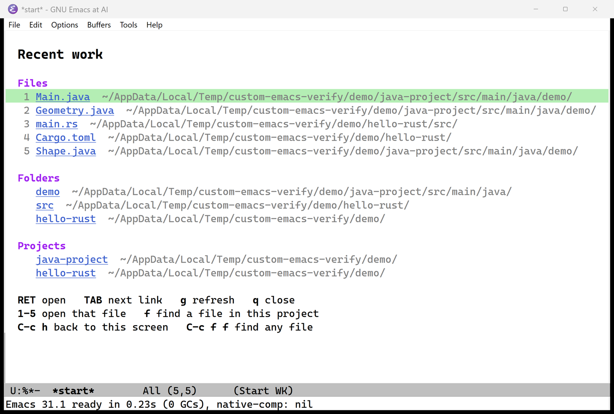
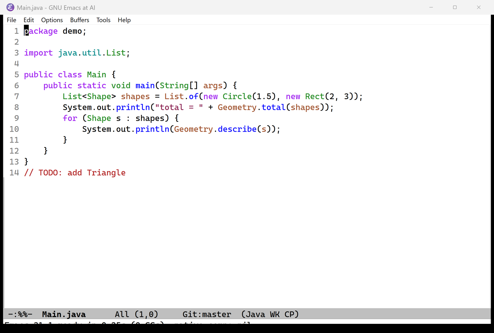
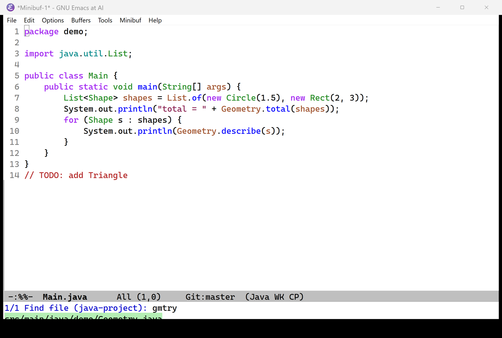
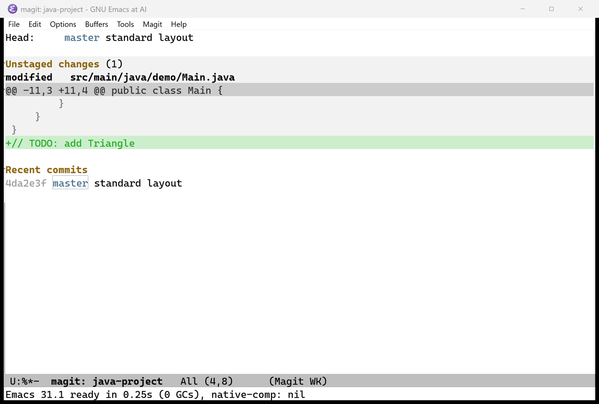

# Portable bundles: unzip and run

A bundle is one zip that holds Emacs, your settings, the packages and the helper programs. You unzip it
anywhere and open `Emacs.exe`. Nothing is installed and nothing is downloaded.

| Bundle | File | Status |
|---|---|---|
| **Windows 10/11, 64-bit** | `custom-emacs-windows-x64.zip` (128 MB zipped, 384 MB unpacked) | **Built and tested**, described below |
| Linux x86-64 | not packaged yet | Next. The Linux build here is Emacs 32, which needs its libraries carried along; see [Linux](#linux) |

The zip is in `dist/` after `./build.sh dist windows` and is **not** committed to git (it is 128 MB and
rebuilt from what is in git).

## Windows

### Using it

1. Unzip `custom-emacs-windows-x64.zip` anywhere you can write (Desktop, `C:\Tools`, a USB stick).
2. Double-click **`Emacs.exe`**.

That is all. It opens on the start screen ([START-SCREEN.md](START-SCREEN.md)):



Everything else behaves as in the Linux guides: Java highlighted by tree-sitter, the fast finder on
`C-c f f`, Magit on `C-x g`.







*These are real screenshots of the unpacked bundle. The demo project and history are examples.*

### What is inside

```
custom-emacs-windows-x64/
├── Emacs.exe          the launcher you double-click (76 KB; source: tools/windows-launcher.c)
├── emacs/             GNU Emacs 31.1 for Windows, the official unmodified build, with all its libraries
├── config/            your settings: early-init.el, init.el, fastfind.el, startpage.el
│   ├── elpa/          Evil and Magit (and Magit's helpers), compiled by the Windows Emacs
│   └── tree-sitter/   Java and Rust grammars for Windows
├── tools/
│   ├── git/           MinGit 2.55: Git for Magit, with its own small shell
│   └── rg/            ripgrep: the fast finder and project text search
├── README.txt
└── DISTRIBUTION.md    this guide
```

What `Emacs.exe` does when you start it: finds its own folder; puts the bundled Git and ripgrep first on
`PATH`; sets `HOME` to your user profile if it is not set, so `~` means `C:\Users\you`; and starts
`emacs\bin\runemacs.exe` (Emacs without a console window) pointing at `config\`. Files or options you give
`Emacs.exe` are passed on to Emacs, so `Emacs.exe notes.txt` opens that file.

**Your changes are saved in the bundle's `config\` folder**: recent files, the folder and project history,
backups and anything `M-x customize` saves. Copying or moving the whole folder moves them with it. It also
means the folder must be writable, so do not put it under `C:\Program Files`.

### How it differs from the Linux build

| | Linux (this repository's build) | Windows bundle |
|---|---|---|
| Emacs | 32.0.50, built from source here | **31.1**, the official GNU build for Windows |
| Native compilation | yes (built-in code is native) | **no**: the official Windows build does not include it, so packages run byte-compiled |
| Speed | startup 0.05 s (measured, headless) | 0.23 s until the window is ready, measured in a real window |
| Line endings for new files | LF | LF: the config sets UTF-8 with LF on Windows (Windows Emacs would otherwise write CRLF). Files that already have CRLF keep them |
| Whole-disk file index | the whole `/`, minus system folders | the drive of your home folder (normally `C:\`), minus `Windows`, `Program Files`, `ProgramData` and a few noisy `AppData` folders |
| Language servers | you install them | you install them (not included: jdtls and rust-analyzer are large and need a JDK or Rust) |

The version difference is deliberate: nobody publishes a Windows build of the Emacs 32 development version,
and compiling one needs a Windows toolchain. Emacs 31.1 runs the same configuration; the test results below
show what was checked.

### What was verified

Everything here was run on the actual bundle, unzipped fresh with Windows' own extractor, on Windows 11 Home
(version 10.0.26200, the machine this was built on), driven from WSL. It was **not** tried on Windows 10 or on another PC.

| Check | Result |
|---|---|
| The zip's Emacs matches GNU's published SHA-256 | Yes (the build script refuses to continue otherwise) |
| Double-clicking `Emacs.exe` opens a real Windows window, on the start screen | Yes (window system `w32`, screenshots above) |
| Bundled Git and ripgrep are the ones found; `HOME` is set | Yes (Git 2.55.0 reported by Magit) |
| Java and Rust tree-sitter grammars load and parse | Yes (highlighted in the screenshot above) |
| Evil and Magit load | Yes |
| **A real commit through Magit**: stage, `c c`, the message buffer opens (1.6 s), it is editable, `C-c C-c` commits, `git log` shows it, and the source file is still read-only afterwards | Yes |
| Whole-drive index (859,000 files on this PC) | built in 1.6 s, queries 67 to 495 ms |
| Offline test suite, the same tests as on Linux, run with the bundle's Emacs | **378 tests: 349 pass, 0 fail, 29 skipped** |
| Contents of the zip (files present, settings identical to the repository, no personal history, packages compiled for Emacs 31) | 12 automated tests in `tests/test_dist.py` |

The 29 skipped tests cannot apply there: 11 need a real `jdtls` and 4 more need language servers, 3 are
network tests you switch on yourself, 4 check the pruned Linux install, 4 check the Linux build (Emacs 32,
native compilation), and 2 need symbolic links (Windows allows them only in Developer Mode or as
administrator; the tests skip themselves when the system refuses).

**Not run on Windows:** the real-window and real-terminal tests (they use a Linux windowing setup and
`tmux`). Instead the checks in the table above were scripted inside the real window, and the screenshots
are the evidence for what it looks like.

### Bugs this work found (and fixed)

Running the existing tests on Windows found real problems in code that had only run on Linux:

- The fast finder built its index with `sh -c ... && mv`, which does not exist on plain Windows. It now
  runs the search program directly and moves the finished file itself, with no shell, on both systems.
- ripgrep prints `C:\path\file` on Windows; the finder matches `/`. It now asks ripgrep for `/` separators.
- The default excluded folders were Linux folders. Windows gets its own list.
- The index build asked Emacs for a pseudo-terminal, and ripgrep then printed colored paths. It now uses a
  plain pipe (this affected Linux too, once the shell was removed).
- New files were saved with CRLF line endings. Now LF.

### Limits and things to know

- **Unsigned.** The launcher is not code-signed. If you download the zip from the internet, Windows
  SmartScreen may show "Windows protected your PC" the first time; choose **More info**, then **Run anyway**.
  Some antivirus programs distrust small unsigned programs; `tools/windows-launcher.c` is 66 lines you can
  read and rebuild. (Not tested against SmartScreen: the copy used here did not come from the internet.)
- **`grep` from the bundled Git treats a backslash differently** from Linux `grep`. It is only a fallback
  when ripgrep is missing, and ripgrep is always in the bundle.
- **x64 only.** On Windows on ARM it should run through Windows' emulation; not tried.
- **Not portable across drives for the history.** The recent-files list stores full paths, so files that
  are on a drive letter that changes (a USB stick) will not open until the letter matches.
- The bundle contains programs with their own licenses: GNU Emacs (GPL v3+), MinGit (GPL v2, see
  `tools\git\LICENSE.txt`), ripgrep (MIT or Unlicense). The Emacs source is at
  https://git.savannah.gnu.org/emacs.git and GNU's Windows build recipe is on the same site.

### Building it yourself

From WSL (or any Linux with `7z` and the ability to run `cmd.exe`; the compile step runs the Windows Emacs):

```sh
./build.sh packages                 # once: Evil and Magit into config/elpa
./build.sh dist windows             # about 1 minute; downloads about 130 MB the first time
tools/test-windows.sh /mnt/c/path/to/unzipped/custom-emacs-windows-x64      # optional: run the offline tests with it
```

`./build.sh dist windows` does, in order: downloads the official Emacs 31.1 zip and checks it against GNU's
published checksum; downloads MinGit and ripgrep; **cross-compiles** the Java and Rust grammars and
`Emacs.exe` for Windows with the `zig` compiler (installed into `dist/.venv`, not on your system);
copies in the four config files and `elpa/`; **recompiles the packages with the bundled Windows Emacs**
(compiled files must come from the Emacs that runs them); and zips. The downloads are cached in
`dist/cache/`.

To update the bundle after you change anything in `config/`: run it again, then run
`python3 -m unittest tests.test_dist`, which fails if the zip's settings differ from the repository.

## Linux

Not packaged yet. The plan: the build made here (Emacs 32, the exact one you run) plus every shared library
it needs (it links about 100, including GTK), the settings, packages, grammars and ripgrep, in one folder with
a launcher, in `.tar.gz` and `.zip`. A first attempt exists and is being finished and tested in a clean
Ubuntu container without GTK installed, since a bundle is only proven when it runs where nothing is
installed. Ask for it and it is the next job.
