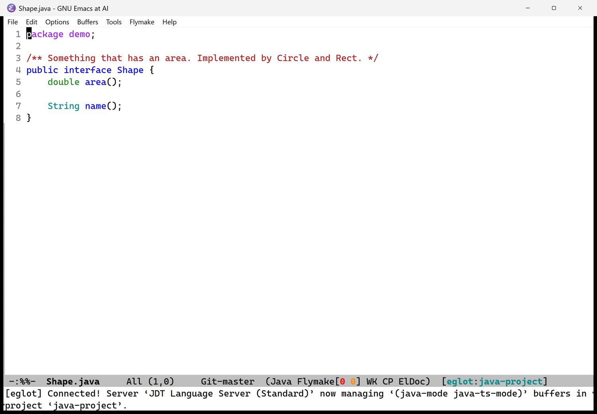
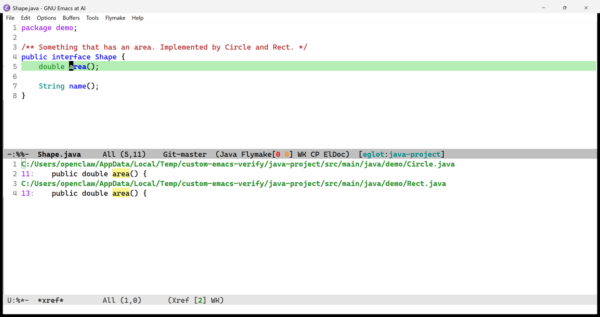
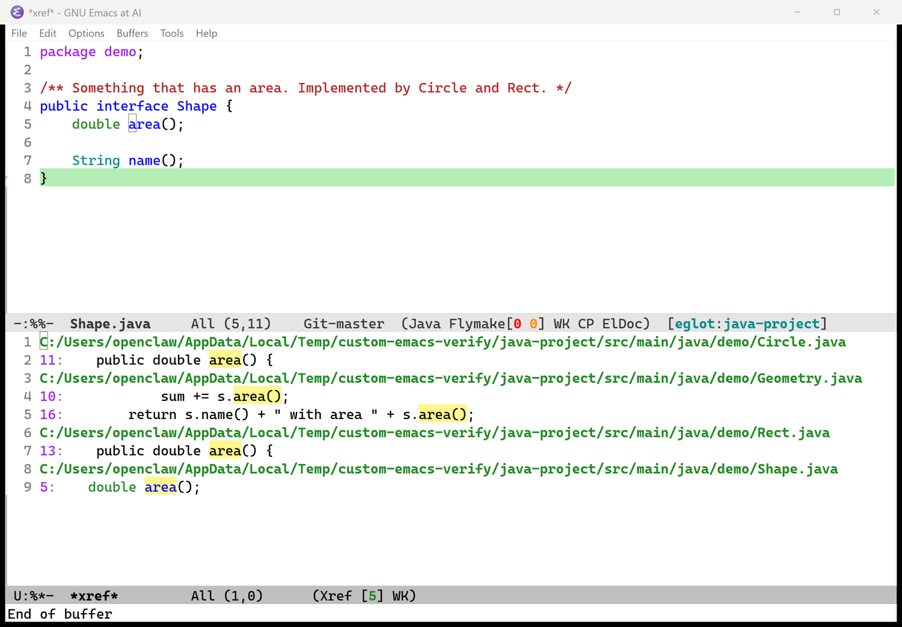

# Eglot: code intelligence from a language server

Eglot connects Emacs to a **language server**: a separate program that understands one programming language
(`jdtls` for Java, `rust-analyzer` for Rust). Emacs alone sees text; with a server it knows what a name *means*.
You get exact jump-to-definition, every use of a symbol, the classes that implement an interface, live error
markers, documentation at the cursor, rename, formatting and quick fixes. Eglot is part of Emacs; nothing
extra is installed for it.

> **What is verified.** The Java navigation answers below come from the **real** `jdtls` on Linux and again on
> the Windows bundle (27 of 27 real-server tests passed there, and the screenshots are real Windows windows).
> Rust was checked on Linux only. Editing features (rename, format, code actions) were **not** run against a real
> server here; where that matters it says so.

## 1. Start it

Eglot never starts by itself (on purpose: `jdtls` is a JVM that takes about 1.35 GB).

1. Open a file inside a project (a folder with `.git`). Java files open in `java-ts-mode`, Rust in `rust-ts-mode`.
2. Run **`M-x eglot`**.
3. Wait for the message *"[eglot] Connected! Server 'JDT Language Server (Standard)' now managing ... buffers in
   project 'java-project'."* The mode line then ends with `[eglot:java-project]`.



*A real Windows window right after connecting. `Flymake[0 0]` is the problem counter (errors, warnings); `[eglot:java-project]`
is the connection.*

| Language | Server | Time to connect (measured) |
|---|---|---|
| Java | `jdtls` 1.61.0 | Linux: **2.7 s**, first symbols 3.7 s. Windows, first start in a project: within about 50 s (the JVM warms up) |
| Rust | `rust-analyzer` | **0.02 s** |

Until it says "Connected", searches can come back empty; try again after a few seconds. Give Java the first minute.

**Stop it** with `M-x eglot-shutdown`; that frees the memory (jdtls about 1.35 GB, rust-analyzer about 340 MB).
Eglot also stops a server on its own when you close the last buffer of the project (`eglot-autoshutdown` is on).
Avoid killing the `java` process from outside: on Windows, the start right after I force-killed a server did not
connect within two and a half minutes (probably a locked project workspace; the run after it connected).

Eglot has **55** entries for languages and their servers (`M-x describe-variable eglot-server-programs`), so for another
language you install its server and run `M-x eglot`.

## 2. What you can do

### Keys

<!-- keymap: global -->
| Key | Command | What it does |
|---|---|---|
| `M-.` | `xref-find-definitions` | jump to the **definition** of the symbol under the cursor |
| `M-,` | `xref-go-back` | go back to where you were |
| `C-M-,` | `xref-go-forward` | go forward again |
| `M-?` | `xref-find-references` | list **every place that uses it** |
| `C-M-.` | `xref-find-apropos` | find classes and methods anywhere in the project by (part of) a name |
| `C-x 4 .` | `xref-find-definitions-other-window` | jump to the definition in another window |
| `M-g i` | `imenu` | list the classes and methods in this file |
| `C-M-i` | `complete-symbol` | complete the name you are typing, from the server |
| `C-h .` | `display-local-help` | show the documentation of the symbol at the cursor (in a managed buffer Eglot points this at ElDoc's documentation buffer) |
| `M-g n` | `next-error` | next problem or next result in a list |
| `M-g p` | `previous-error` | previous one |

With the mouse: **Ctrl+Click** a symbol jumps to its definition; **right-click** shows Find Definition, Find References,
Find Implementations and Find Type Definition, and Go Back once you have jumped. Details in [NAVIGATING-CODE.md](NAVIGATING-CODE.md#5-java-definition-implementations-references).

### Commands you run by name (`M-x`)

| Run | What it does |
|---|---|
| `eglot-find-implementation` | the classes that implement this interface or method |
| `eglot-find-type-definition` | jump to the type of a variable or value |
| `eglot-find-declaration` | jump to the declaration |
| `eglot-show-type-hierarchy` | the parents and children of a class |
| `eglot-show-call-hierarchy` | who calls this, and what it calls |
| `eglot-rename` | rename a symbol everywhere it is used |
| `eglot-format` / `eglot-format-buffer` | reformat the region or the whole file |
| `eglot-code-actions` | the quick fixes and refactorings available at the cursor |
| `eglot-code-action-quickfix`, `eglot-code-action-organize-imports`, `eglot-code-action-extract`, `eglot-code-action-inline`, `eglot-code-action-rewrite` | run one kind of action directly |
| `eglot-inlay-hints-mode` | show parameter names and inferred types inline |
| `eglot-reconnect` | reconnect after the server stopped or was restarted |
| `eglot-list-connections` | show the running servers |
| `eglot-shutdown` | stop the server |
| `eglot-events-buffer`, `eglot-stderr-buffer` | the protocol log and the server's error output, for debugging |

### Problems while you type: Flymake

The server reports errors and warnings as you edit; Flymake underlines them and counts them in the mode line
(`Flymake[errors warnings]`). Flymake has **no default keys** here. Use the menu bar's **Flymake** menu
(Go to next problem, Go to previous problem, List all problems) or run:

| Run | What it does |
|---|---|
| `flymake-goto-next-error` / `flymake-goto-prev-error` | move to the next or previous problem |
| `flymake-show-buffer-diagnostics` | list the problems in this file (clicking the left fringe does the same) |
| `flymake-show-project-diagnostics` | list the problems in the whole project |

### Documentation at the cursor: ElDoc

When the cursor rests on a symbol for half a second, its signature and documentation appear in the echo area.
`C-h .` opens the fuller text in its own window.

## 3. Worked example (measured)

The demo project (`~/emacs-demo/java-project`): an interface `Shape` with two implementations, `Circle` and `Rect`,
a `Geometry` class that uses them, and a `Main`.

| You put the cursor on | You do | The real server answers |
|---|---|---|
| `total` in `Geometry.total(shapes)` in `Main.java` | `M-.` | `Geometry.java:7` |
| `area` in `s.area()` in `Geometry.java` | `M-.` | `Shape.java:5` (the call goes through the interface) |
| `area` in `Shape.java` | `M-x eglot-find-implementation` | `Circle.java:11`, `Rect.java:13` |
| `area` in `Shape.java` | `M-?` | 5 places: `Shape.java:5`, `Circle.java:11`, `Rect.java:13`, `Geometry.java:10` and `:16` |
| `Shape` in `Shape.java` | `M-?` | 8 places |
| `Shape` in `Geometry.java` (a parameter type) | `M-x eglot-find-type-definition` | `Shape.java:4` |

The same questions on the **Windows** bundle, real windows:



*`M-x eglot-find-implementation` on `area`: `Circle.java:11` and `Rect.java:13`, the same answer as on Linux.*



*`M-?` on `area`: the five uses, grouped by file, in the same list used for text search ([SEARCHING.md](SEARCHING.md)).*

## 4. How it is set up here

All in `config/init.el`, sections "Languages" and "Clicking through code":

| Setting | Effect |
|---|---|
| Servers are never started automatically | `M-x eglot` is deliberate |
| `(setq eglot-events-buffer-config '(:size 0))` | do not log every protocol message (faster; use `eglot-events-buffer-config` to turn it on when debugging) |
| `eglot-workspace-configuration` with `java.project.sourcePaths` = `src/main/java`, `src` | tells `jdtls` where the sources are in projects without a build file (see below) |
| `(context-menu-mode 1)`, `global-xref-mouse-mode` | right-click menu and Ctrl+Click for definitions |
| `my/context-menu-eglot` | adds Find Implementations and Find Type Definition to the right-click menu while a server runs |
| `eglot-autoshutdown` | left at Emacs's default: the server stops with the project's last buffer |
| **Windows bundle only:** `my/bundled-jdtls-command` | starts the bundled `jdtls` on your own Java (below) |

**Project layout.** `jdtls` needs to know where the source files start. With a `pom.xml` or `build.gradle` it reads that.
Without one, this config tells it `src/main/java` or `src`. If your sources are somewhere else, references to a
**class or interface** come back empty while methods still work; add a `.dir-locals.el` at the project root:

```elisp
((java-ts-mode . ((eglot-workspace-configuration . (:java (:project (:sourcePaths ["path/to/sources"])))))))
```

Emacs asks once whether to trust that file; answer `!` to remember.

## 5. Eglot and the read-only lock

Every file opens read-only in this config. **Reading and navigating never need editing**, so everything in sections 1 and
3 works with the lock on. The features that **change** files are different:

- `eglot-rename`, `eglot-format`, and code actions edit the buffers they touch. In a locked buffer Emacs refuses
  with *"Buffer is read-only"*. Unlock the file first with `C-c e e`. (Measured on plain Emacs: a replace in a locked
  buffer errors and leaves it unmodified. **Not run** here against a real rename, which touches several files:
  I expect each affected file to need unlocking, and Eglot to ask before applying edits across files, since
  `eglot-confirm-server-edits` is set to confirm with a summary.)
- Diagnostics, hover text, definitions, references and implementations only read.

## 6. Windows: the server is bundled, the JDK is not

The Windows bundle ([DISTRIBUTION.md](DISTRIBUTION.md)) carries **`jdtls` 1.61.0** (`tools\jdtls`), but no JDK ---
install one yourself (17 or newer), the same as Rust needs its own `rust-analyzer` installed. Eglot's own
entry for Java looks for a program called `jdtls`, which is a Python script and would need Python; the bundle
skips that and starts the server directly with whatever `java` it finds on `PATH` or `JAVA_HOME`:

```
java -Declipse.application=org.eclipse.jdt.ls.core.id1 ... -jar tools\jdtls\plugins\org.eclipse.equinox.launcher_*.jar
    -configuration tools\jdtls\config_win  -data config\jdtls-workspaces\<one folder per project>
```

- If no `java` is found, `M-x eglot` fails with a clear message telling you to install a JDK first, rather than
  a confusing Eglot error.
- The per-project workspace lives in `config\jdtls-workspaces\`. Deleting a project's folder there forces a clean start.
- `java` and `javac` are on that `PATH` too, so a shell you open inside Emacs (`M-x shell`) should find them (I did not try it).
- **Rust is not bundled.** `rust-analyzer` needs a Rust toolchain; install one and Eglot uses it as on Linux.

Measured on the Windows bundle: **27 of 27** `java-navigation` tests with the real server (definitions, implementations,
references, type definition, find by name), and the screenshots above.

## 7. Troubleshooting

| Symptom | Cause and fix |
|---|---|
| **"Couldn't guess LSP for Java ts mode. Enter program to execute"** | Eglot could not find the server program. On Linux/WSL: `jdtls` is not on `PATH` (see [LANGUAGES.md](LANGUAGES.md#setting-it-up-again-from-scratch)). On Windows: you are not using `Emacs.exe` from the bundle (only it sets the paths), or the folder `tools\jdtls` is missing |
| `M-.` says **"No Xref backend"** | No server is running. `M-x eglot` |
| Everything comes back empty at first | The server is still starting. Wait for "Connected", and for Java give it a few more seconds |
| References to a **class** are empty but methods work | The source folder is not `src/main/java` or `src`: add the `.dir-locals.el` above |
| A red *"The declared package ... does not match"* mark | The same cause |
| The server "died" or hangs | `M-x eglot-reconnect`; if it repeats, `M-x eglot-shutdown`, then `M-x eglot` |
| Java uses over a gigabyte | Expected (a JVM). `M-x eglot-shutdown` frees it |
| On Windows the first start takes about a minute, or does not connect after a server was killed | A cold JVM start is slow. After a kill, close Emacs, try deleting that project's folder in `config\jdtls-workspaces\` and start again (a likely fix, not tested) |
| To see what the server said | `M-x eglot-stderr-buffer` (its error output), or set `eglot-events-buffer-config` to `(:size 2000000)` and open `M-x eglot-events-buffer` |

## 8. Tests

`tests/ert/languages-java-rust.el` covers the server configuration and (with `./build.sh test --lsp`) real
servers answering through Eglot; `tests/ert/java-navigation.el` covers every navigation answer in section 3 against
a real `jdtls`, and the right-click and Ctrl+Click behavior. The Windows bundle command is unit-tested
(`langs/bundled-jdtls-*`) and ran the full real-server set on Windows (`LSP=1 tools/test-windows.sh`). See [TESTING.md](TESTING.md).

## 9. Related guides

- [SEARCHING.md](SEARCHING.md): all the ways to find things, and where Eglot fits.
- [NAVIGATING-CODE.md](NAVIGATING-CODE.md): the finder and Java navigation in depth.
- [LANGUAGES.md](LANGUAGES.md): what Java and Rust cost, measured, and how to set the servers up again.
- [KEYBOARD.md](KEYBOARD.md): every key.
