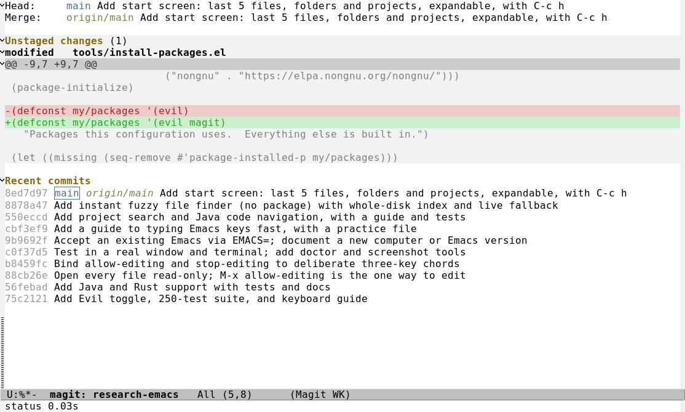
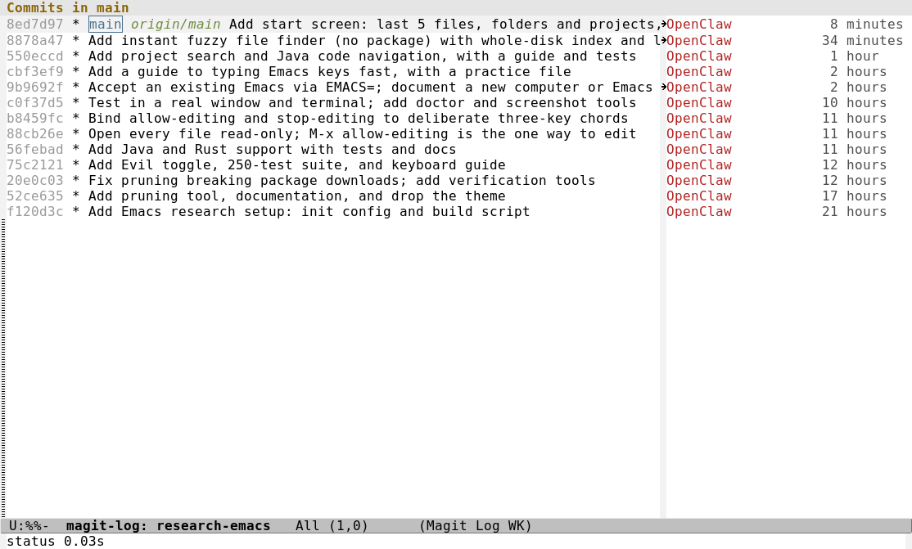

# Magit: Git inside Emacs

Magit is a keyboard-driven interface to Git. `C-x g` opens a **status** screen for the current
repository: what changed, what is staged, and the recent commits. Then single keys do the work:
`s` stages, `c c` commits, `P p` pushes. It is the one package here besides Evil, installed by
`./build.sh packages` (Magit 4.7.1 with its helpers `magit-section`, `with-editor`, `llama` and
`cond-let`, all in `config/elpa/`, which is gitignored).

*The status of this repository: the branch and its upstream, an uncommitted change shown as an
expanded diff (red removed, green added), and the recent commits.*

*`l l` shows the history, with the commit graph, author and age.*

> **What is verified.** 11 offline tests, one in a real window, and two in a real terminal:
> opening the status, and a **real commit** typed through Magit's message buffer, checked in
> `git log`. The keys in the tables below are checked against this build (`keys/magit-keys-match-the-guide`).
> The screenshots have no theme, as in the rest of this config.

## Cost

| | Measured |
|---|---|
| Startup with Magit installed | 0.06 s (unchanged): nothing loads until you press `C-x g` |
| First `C-x g` in a session | about 0.5 s (loading Magit) |
| Every later status screen | about 0.05 s |

## Starting

<!-- keymap: global -->
| Key | Command | What it does |
|---|---|---|
| `C-x g` | `magit-status` | the status screen of the repository you are in |
| `C-c g` | `magit-file-dispatch` | Git commands for the **current file** (its history, blame, stage) |

Not in a repository? Magit offers to pick one. From the start screen ([START-SCREEN.md](START-SCREEN.md)),
open a project and press `C-x g` there.

## In the status screen

You do not type Git commands. You put the cursor on something and press a key. Lines such as
"Unstaged changes", each file, and each hunk can be **folded** with `TAB`.

<!-- keymap: magit-status-mode-map -->
| Key | Command | What it does |
|---|---|---|
| `n` | `magit-section-forward` | next section, file or hunk |
| `p` | `magit-section-backward` | previous |
| `TAB` | `magit-section-toggle` | show or hide the diff under the cursor |
| `RET` | `magit-visit-thing` | open the file at that line (**read-only**; `C-c e e` to edit) |
| `s` | `magit-stage-files` | stage the file, hunk, or the whole section under the cursor |
| `u` | `magit-unstage-files` | unstage it |
| `S` | `magit-stage-modified` | stage every modified file |
| `U` | `magit-unstage-all` | unstage everything |
| `k` | `magit-delete-thing` | discard the change under the cursor (asks first) |
| `c` | `magit-commit` | the commit menu; `c` again makes a commit |
| `l` | `magit-log` | the history menu; `l` again shows the current branch |
| `d` | `magit-diff` | compare things |
| `b` | `magit-branch` | branches: switch (`b`), create (`c`) |
| `f` | `magit-fetch` | fetch from the remote |
| `F` | `magit-pull` | pull |
| `P` | `magit-push` | push (`P p` pushes to the upstream) |
| `m` | `magit-merge` | merge |
| `r` | `magit-rebase` | rebase |
| `z` | `magit-stash` | stash your changes |
| `t` | `magit-tag` | tags |
| `g` | `magit-refresh` | redraw after something changed outside |
| `$` | `magit-process-buffer` | show the Git commands Magit ran, and their output |
| `?` | `magit-dispatch` | the list of every command, when you forget one |
| `q` | `magit-mode-bury-buffer` | close the screen |
<!-- keymap: global -->

Every menu (`c`, `l`, `P`...) is a popup listing the next keys, so you can learn as you go.

## The everyday cycle: stage, commit, push

1. `C-x g`. Look at what changed. `TAB` on a file to read its diff.
2. `s` on the file (or on **Unstaged changes** for all of them).
3. `c` then `c`. A message buffer opens with the staged diff below it.
4. **Type the message**, then `C-c C-c` to commit. `C-c C-k` cancels.
5. `P` then `p` to push.

<!-- keymap: with-editor-mode-map -->
| Key | Command | What it does |
|---|---|---|
| `C-c C-c` | `with-editor-finish` | finish the message and commit |
| `C-c C-k` | `with-editor-cancel` | cancel the commit |
<!-- keymap: global -->

## Magit and the read-only lock

Every file opens read-only in this config ([KEYBOARD.md](KEYBOARD.md)). That would make committing
impossible, since a commit message is a file Git asks you to edit. So the lock has **one exception**:
the files Git creates for you inside `.git/`: `COMMIT_EDITMSG`, `MERGE_MSG`, `TAG_EDITMSG`,
`NOTES_EDITMSG`, `PULLREQ_EDITMSG`, `EDIT_DESCRIPTION` and `git-rebase-todo`. They open editable.
Nothing else does: your source files stay locked, and the terminal test checks that right after a commit.
The list is `my/always-editable-file-regexp` in `init.el`.

## Not installed?

`C-x g` then says "Magit is not installed. Run ./build.sh packages", and nothing else breaks. The tests
that need it skip themselves.

## What was left out

Forge (GitHub pull requests and issues) is a separate package and is not installed. Your earlier
`gitmacs` project used `magit` with the `doom-tokyo-night` theme and `doom-modeline`; this config has
no theme yet, so Magit looks plain (screenshots above). Colors come from whatever theme you add later.
