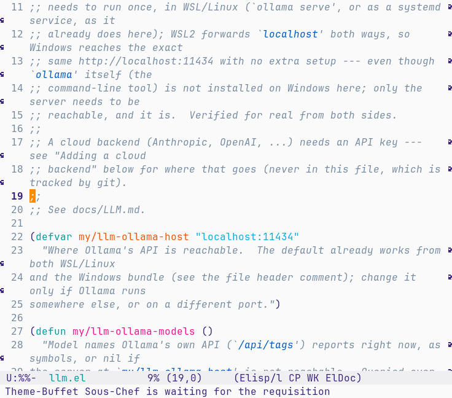
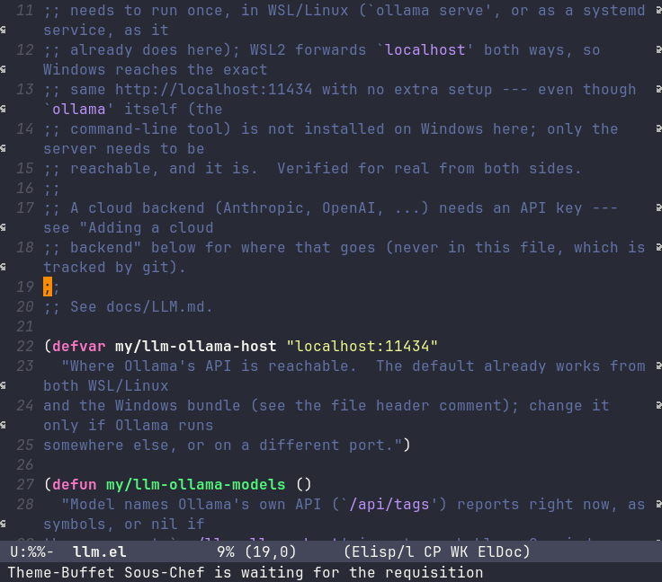
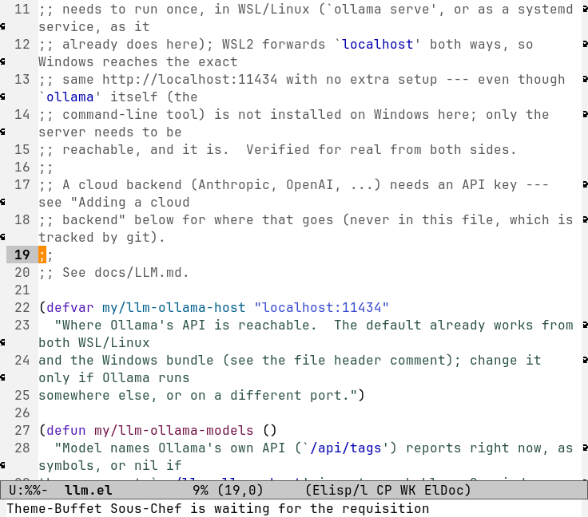
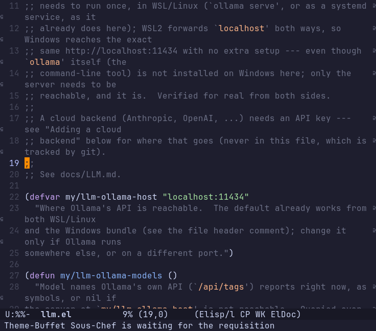

# My notes

A personal, running log of real commands and gotchas, kept short for quick reference and
printing --- not the polished general guides ([KEYBOARD.md](KEYBOARD.md) etc.), just
commands and one-line notes, added to as they come up.

## Opening Emacs

| Command | What it opens |
|---|---|
| `install/bin/emacs --init-directory=$PWD/config` | this repo, Linux/WSL, the normal pruned install |
| `build/src/emacs --init-directory=$PWD/config` | this repo, straight from the build tree, unpruned |
| double-click `Emacs.exe` inside the unzipped folder | the portable Windows bundle |
| `./Emacs` inside the unzipped folder | the portable Linux bundle |

`--init-directory=` is what makes it *this* config; without it, Emacs falls back to its own stock default.

## Exiting Emacs

| Command | What it does |
|---|---|
| `C-x C-c` | quit Emacs entirely (asks to save any unsaved files first) |
| `q` (in Magit/Treemacs/Dired/ibuffer/start screen/docs/shortcuts buffers) | closes just that buffer/window, not Emacs |
| `C-x 5 0` | close just the current frame (OS window) |

## Opening/closing the browsing buffers

| Open | Close | What |
|---|---|---|
| `C-x d` / `C-x C-j` | `q` | Dired |
| `C-c t` / `C-c T` | `q` (hide) / `Q` (reset) | Treemacs |
| `C-c h` | `q` | Start screen --- recent files/folders/projects |
| `C-c f p` | `q` | Git repos list |
| `C-x g` (also `C-c g`) | `q` (`C-u q` kills it) | Magit status |
| `C-c a a` | `C-x k` | LLM chat (gptel) |
| `C-c a c` | `q` | LLM council |
| `C-c n` | `q` | News (newsticker) |
| `C-c d` (`C-c D` rebuilds) | `q` | Docs buffer |
| `C-c k` | `q` | Shortcuts buffer |
| `C-c w l` | `q` | Session list |
| `C-c w L` | `q` | Named sessions list |
| `C-c y` | `q` | Year calendar |
| `C-c m` | `C-c m` again | Dictation |
| `C-c M` | `C-c M` again | Live dictation |
| `C-c v` | `C-c v` again | Evil, vi keys |

## Ways to open a file, by scope (find files)

| Scope | Command | Method | Source |
|---|---|---|---|
| Folder | `C-x C-f` | built-in completion, current directory | Built-in |
| Folder | `C-x d`/`C-x C-j` then `RET` | Dired browse | Built-in |
| Folder | `C-c t` then `RET` | Treemacs browse | Package (Treemacs) |
| Folder | `C-c f d` | fuzzy, live only, current dir subtree | **Custom** |
| Project | `C-c f f` | fuzzy, cached index + live fallback | **Custom** |
| Project | `C-x p f` | built-in completion, not fuzzy; follows current buffer's project, same as `C-c f f` | Built-in |
| Project | `C-x p d` | Dired on project root | Built-in |
| Project | `C-c s f` (`consult-fd`) | literal/regexp, `fd`, no live preview | Package (Consult) |
| Disk | `C-c f g` | fuzzy, cached whole-disk index + live fallback | **Custom** |
| Disk | `C-c f a` | same, async (Consult/fd), never blocks | **Custom** (wraps `consult-fd`) |
| History | `C-c h` then `RET`/number | recent list, no query typed | **Custom** |

`gmtry` finds `Geometry.java` via the fuzzy commands (`f f`/`f g`/`f d`), not via `C-x p f`/`C-c s f`.

## Searching text, by scope (Consult + built-ins compared)

| Scope | Command | Match type | Live preview | Source |
|---|---|---|---|---|
| This buffer | `C-s`/`C-r` | simple (`M-r`→regexp) | yes | Built-in |
| This buffer | `C-M-s`/`C-M-r` | regexp | yes | Built-in |
| This buffer | `C-c s l` (`consult-line`) | completion-style | yes | Package (Consult) |
| This buffer | `M-s o` (`occur`) | regexp | no | Built-in |
| This buffer | `M-%`/`C-M-%` | simple/regexp | no (steps, asks y/n) | Built-in |
| Directory (ask) | `C-u C-c s g` | ripgrep literal/regexp | yes | Package (Consult) |
| Directory (ask) | `C-u C-x p g` | regexp | no | Built-in |
| Project | `C-c s g` (`consult-ripgrep`) | ripgrep literal/regexp | yes | Package (Consult) |
| Project | `C-x p g` | regexp | no | Built-in |
| Multiple buffers | `M-x consult-line-multi` | completion-style | yes | Package (Consult) |
| Multiple buffers | `M-x multi-occur` | regexp | no | Built-in |

- No dedicated key for directory-scoped text search --- `C-u` in front of the project-search commands prompts for a directory instead.

## LLM

| Command | Note |
|---|---|
| `C-c a a` | Ollama auto-setup via its `/api/tags` HTTP endpoint directly, no `ollama` CLI needed |
| `C-c a m` | switch model/backend/prompt; ChatGPT/Claude/Gemini pre-registered but inactive until a key is in `~/.authinfo.gpg` |
| `C-c a c` | 3 small local models in parallel + 1 separate bigger summarizer, never the largest model pulled |

## Dictation

| Command | Note |
|---|---|
| `C-c m` / `C-c M` | fully local (whisper.cpp), no cloud, no API key |
| Linux stop | `SIGTERM` + wait --- `delete-process` alone corrupts the WAV header |
| Windows stop | sends `"q"` on stdin --- no `SIGTERM` equivalent on Windows |

## Session

| Topic | Note |
|---|---|
| `emacs-session.el` name | avoids a real collision with a third-party `session` package Org expects |
| `auto-save-visited-mode` | saves an unlocked (`C-c e e`), edited buffer back to disk a few seconds after you stop typing |
| What actually gets saved | window placement, buffers, files and frame chrome (menu bar/tool bar/decorations) all persist on their own, via `desktop-save-mode`'s own "frameset" mechanism --- confirmed directly by inspecting a real saved file, not assumed from the name "session" |
| The color theme | did NOT persist on its own (`theme-buffet` always re-picked a fresh random one at every startup regardless) --- fixed with `my/session-theme`, saved/restored via `desktop-globals-to-save` + `desktop-save-hook`/`desktop-after-read-hook`, timed to run after `theme-buffet`'s own startup pick so it correctly wins |
| `C-c w r` (`my/session-reset`) | only deletes the *saved* file --- it does **not** touch your currently running Emacs's frame/theme at all. If menu-bar/theme/etc. are wrong in the live session when you run this, they'll just get auto-saved wrong again on the very next exit. Fix the live state first (or use `C-c U`, which does both at once), then reset/save |

## Which-key

| Topic | Note |
|---|---|
| `*` in Dired | a real prefix key (the mark submenu) --- good way to see the popup: open Dired, press `*`, wait a second |
| Popup side | stock bottom, everywhere, no exceptions --- tried moving it to the right (globally, then scoped to just Dired/Org) across two earlier attempts this session, reverted both times; the right side in Dired/Org is now used by `C-o`'s Casual menu and the always-visible reference panel instead (below) |

## Dired and Org: Casual (`C-o`) and the always-visible reference panel

Two deliberately different things, both now living on the right in just these two
modes --- worth keeping straight:

| Topic | Note |
|---|---|
| `C-o` (Casual) | a real, Magit-style **transient** popup --- modal, takes over the keyboard, closes the instant you pick one action. `casual-dired-tmenu` in Dired (grouped File/Directory/Bulk/Navigation/Quick/Search/New), `casual-org-tmenu` in Org (grouped Headline/Date/Priority/Link/Timestamp/Mark/etc., context-aware --- shows the actual heading text at point) |
| The reference panel | the opposite --- a plain, read-only, **non-modal** sidebar (`my/mode-reference-mode`, `config/mode-reference.el`), always visible the moment you're in a real Dired or Org buffer, never grabs focus, never closes on its own mid-task. Content is a hand-written, narrow-column transcript of Casual's own real menu (kept in sync by hand, the same tradeoff `docs/KEYBOARD.md`/`C-c k` already accept) |
| Package (Casual) | `casual` (github.com/kickingvegas/casual), verified directly against MELPA, not assumed --- a big umbrella package (109 files), covers other built-in modes too (re-builder, timezone, etc.), only the Dired and Org parts are wired up here |
| The Dired `C-o` collision | was already `dired-display-file` (show in another window, don't switch) --- kept Casual on `C-o` anyway, matching its own documented cross-mode convention; `o`/`v` already cover similar ground, `M-x dired-display-file` still works directly. Org had no existing `C-o` binding of its own, confirmed directly, so no collision there |
| First use is slower | loading (and likely natively compiling, like any installed package's first real use) `casual-dired`/`casual-org` the first time `C-o` is pressed in a session takes a few real seconds, confirmed directly (not instant) --- every use after that in the same session is fast |
| The real window-slot conflict | both the panel and Casual's menu wanted the exact same right-side window --- found by testing: the second one to try displaying silently failed to show at all, while its modal keymap still captured every keystroke (very confusing until tracked down). Fixed by giving them distinct `slot` values on the same `(side . right)` edge (panel: slot 1, Casual: slot 0) --- they now genuinely coexist, stacked, Casual's menu appearing above the panel when `C-o` is pressed while it's already showing |
| Auto show/hide | `dired-mode-hook`/`org-mode-hook` (covers the very first buffer at startup) plus `window-selection-change-functions`/`window-buffer-change-functions` (covers every later switch) --- a real gap found by testing: the window-change hooks alone never fire for the first buffer shown at startup, since there is no prior session state to have "changed" from |

## Org mode

| Topic | Note |
|---|---|
| `.org` auto-activation | back on (was disabled for one session, then re-enabled on request) --- `.org` files open in real `org-mode` again |
| Its ~103 `C-c` bindings | confirmed mode-local, not global: a plain buffer sees 25 `C-c` bindings (this config's own), a real org buffer sees 109 --- they never show up in any other file type |

## Year calendar

| Command | Note |
|---|---|
| `C-c y` | real 12-month grid (4 rows x 3) --- stock `M-x calendar` only ever lays out one wide row |
| `*Year Calendar*` buffer | separate from the real `*Calendar*`, doesn't touch `calendar-total-months` |

## News

| Topic | Note |
|---|---|
| `C-c n` | built into Emacs (`net/newsticker.el`), no package |
| Fetching | `url-retrieve`, no external `wget`/`curl` --- works on the Windows bundle too |
| Feeds | 10 curl-verified live feeds, one per category |
| Loading | nothing fetches until `C-c n` is actually pressed |

## Themes

| Command | Note |
|---|---|
| `C-c c` *char* | pick a color theme by character --- `1`-`9`, then `a`-`z`, then `A`-`T` (55 themes total), `0` for the default (Emacs's own plain look) --- never stacks (previous theme disabled first) |
| `C-c .` / `C-c ,` | switch to the next/previous theme in the list, whatever character it's bound to --- for when the specific slot doesn't matter, wraps around at either end |
| `C-c C` | `consult-theme` --- fuzzy-search any installed theme *by name* with a live preview, including every `doom-themes` variant (see below), instead of memorizing a character |
| `M`-`T` | Modus Themes, light then dark: operandi / tinted / deuteranopia / tritanopia / vivendi / tinted / deuteranopia / tritanopia |
| (automatic) | `theme-buffet` still only rotates the 8 Modus Themes light/dark by time of day, re-checked hourly --- `C-c c`/`C-c .`/`C-c C` always override it; none of the other 47 themes were added to its rotation |

The full `C-c c` character -> theme mapping, grouped by package (also in `my/themes` in
`config/init.el`, the single source of truth --- this table is just a friendlier view
of the same thing):

| Key | Theme | | Key | Theme |
|---|---|---|---|---|
| `1` | atom-one-dark | | `2` | catppuccin (mocha) |
| `3` | solo-jazz | | `4` | nimbus |
| `5` | rebecca | | `6` | subatomic |
| `7` | night-owl | | `8` | seti |
| `b` | snazzy | | `c` | horizon |
| `h` | zenburn | | `u` | dracula |

**shanty-themes:** `9` dark, `a` light
**xcode-theme:** `d` dark, `e` light
**immaterial-theme:** `f` dark, `g` light
**ember-theme** (manual-only, needs `doom-themes`): `K` light, `L` soft

**solarized-theme** (12): `i` dark, `j` light, `k` dark-high-contrast, `l`
light-high-contrast, `m` gruvbox-dark, `n` gruvbox-light, `o` selenized-black, `p`
selenized-dark, `q` selenized-light, `r` selenized-white, `s` wombat-dark, `t` zenburn

**kaolin-themes** (15): `v` dark, `w` light, `x` aurora, `y` blossom, `z` breeze, `A`
bubblegum, `B` eclipse, `C` galaxy, `D` mono-dark, `E` mono-light, `F` ocean, `G` shiva,
`H` temple, `I` valley-dark, `J` valley-light

**Modus Themes** (8, built-in): `M` operandi, `N` operandi-tinted, `O`
operandi-deuteranopia, `P` operandi-tritanopia, `Q` vivendi, `R` vivendi-tinted, `S`
vivendi-deuteranopia, `T` vivendi-tritanopia

Plus `0` for the default (no theme). `doom-themes`'s own 50+ variants aren't on this
list at all --- reach those through `C-c C`'s fuzzy search by name instead.

All 8 [Modus Themes](https://github.com/protesilaos/modus-themes) ship built into Emacs 28+ already --- no package, confirmed directly (`etc/themes/modus-*-theme.el`). The other 47 come from 15 separately installed packages (`atom-one-dark-theme`, `catppuccin-theme`, `solo-jazz-theme`, `nimbus-theme`, `rebecca-theme`, `subatomic-theme`, `night-owl-theme`, `seti-theme`, `shanty-themes`, `snazzy-theme`, `horizon-theme`, `xcode-theme`, `immaterial-theme`, `zenburn-theme`, `solarized-theme`, `dracula-theme`, `kaolin-themes`, `ember-theme` --- full URLs in the WHAT/WHY comment above `my/themes` in `config/init.el`). A real, easy-to-get-backwards gotcha found while wiring these up: `load-theme` never consults `load-path` at all --- it always does its own file search through `custom-theme-load-path`, whose `t` entry expands to Emacs's *built-in* `etc/themes` directory, not to `load-path`; a theme package can `require` fine while still being completely invisible to `load-theme`/`consult-theme` unless its directory is *also* pushed onto `custom-theme-load-path` (now done in the same loop that adds `config/elpa`'s subdirectories to `load-path`). `my/themes` in `config/init.el` is the character→theme mapping; add more there (any installed theme) to extend `C-c c` without a new keybinding. `ember-theme` needs `doom-themes` as a hard dependency --- installed, but deliberately never `require`d automatically (this project's own `startup/no-third-party-features-loaded' test forbids it), so `doom-themes`'s own 50+ variants are reachable only via `C-c C`'s fuzzy search, never a `my/themes` slot. `theme-buffet` is a real GNU ELPA package (not one of Protesilaos's own, despite appearing in his dotfiles) --- `my/themes-light`/`my/themes-dark` is where it's told which of `my/themes`'s entries count as which; keep both lists in step when adding a theme that should also take part in the automatic rotation.

**The fixed cursor color, across 4 of the 55 themes** (real screenshots of this build,
same file and same line in every shot, so the only thing that changes is the theme):
`enable-theme-functions` keeps the cursor a fixed `DarkOrange` no matter which theme is
active, since several themes don't give it enough contrast against their own `hl-line`
color on their own.

*`solo-jazz` (light) --- the theme the regression test itself uses, since this was visibly wrong here before the fix:*

*`dracula` (dark):*

*`modus-operandi` (the built-in, accessible light theme):*

*`catppuccin` (mocha):*

## Magit

| Topic | Note |
|---|---|
| "pathspec '...' did not match" | git has no such branch/tag, not a Magit bug --- `b b` to pick an existing one, `b c` to create a new one |
| Transient switches | keys literally include a `-` (e.g. `-n`, `-A`) --- press `-` then the letter |

## Dist bundles / GitHub Actions

| Topic | Note |
|---|---|
| Fresh unzipped bundle | no `recentf`/`recents` history shipped --- always starts clean |
| `.github/workflows/release.yml` | Linux only (Windows dist needs WSL/`cmd.exe`) --- triggers on a pushed version tag (`v*`) |
