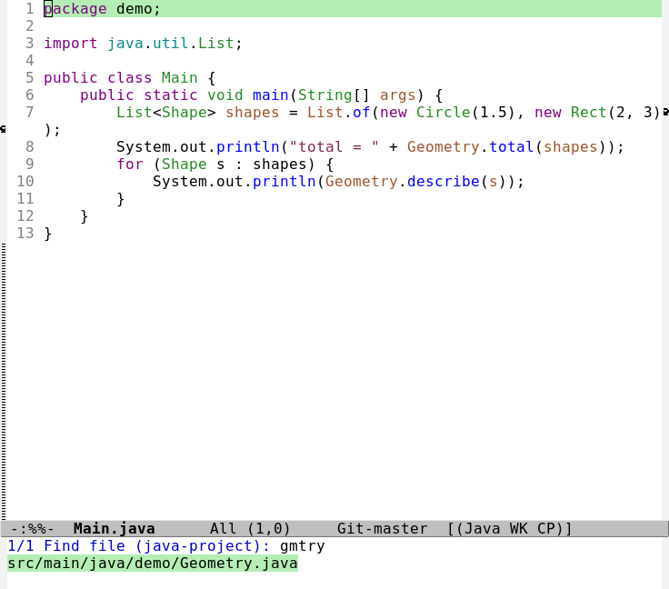
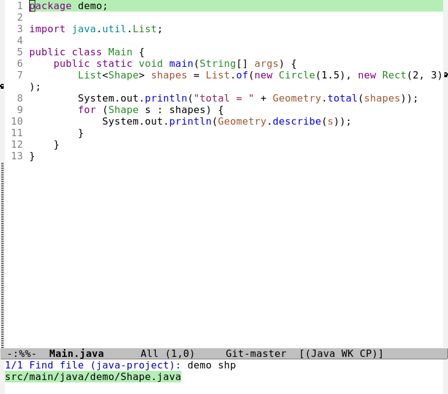
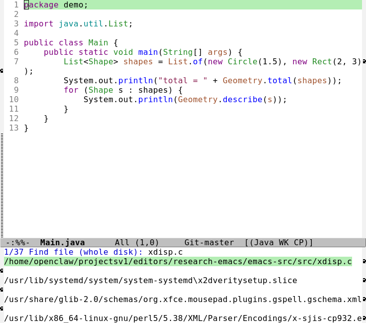
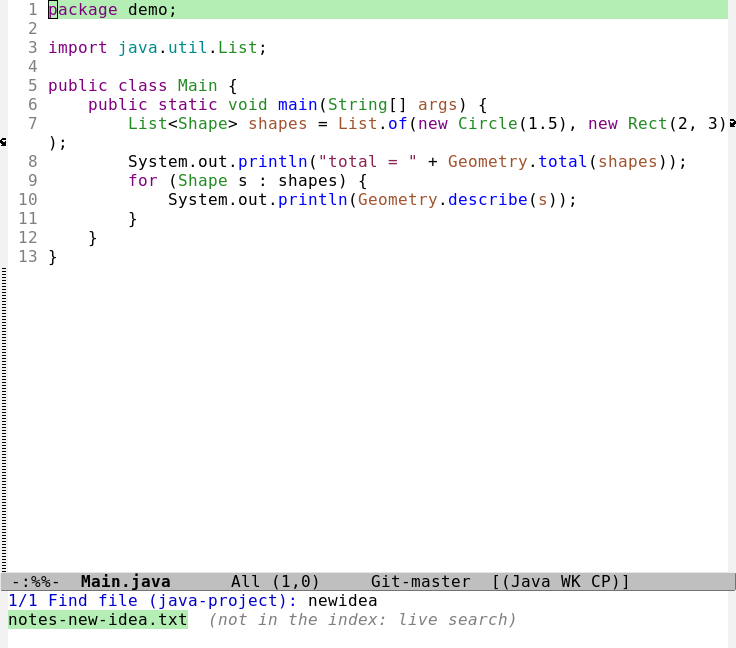
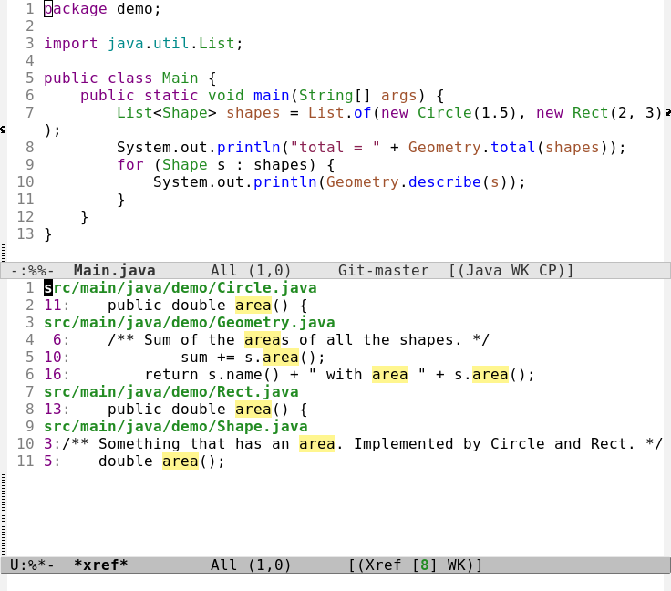

# Finding files and navigating code

How to find a file in a project, search across it, and (for Java) click a method to see its
definition, its implementations and everything that uses it. Everything here uses features
built into Emacs plus the language server for Java, which is already set up
([LANGUAGES.md](LANGUAGES.md)).

> **What is verified.** Every key in the tables is checked against this build by
> `tests/ert/keybindings.el`. The Java behavior was checked against the **real `jdtls`
> server** on a demo project (section 6), with the numbers below taken from those runs. The
> mouse gestures are verified by simulating the events and checking the menus and bindings;
> nobody physically clicked during testing, so tell me if a click does not behave as described.

## 1. The short version

| I want to... | Keyboard | Mouse |
|---|---|---|
| Open a file in this project | `C-x p f`, then type part of its name | |
| **Open a file instantly, by a few letters** (project, or the whole disk) | `C-c f f` (project) / `C-c f g` (whole disk) | |
| Search text in every project file | `C-x p g` | |
| Search text in this file | `C-s` | |
| Jump to the definition of a method or class | `M-.` | **Ctrl+Click** it, or right-click, **Find Definition** |
| Go back to where I was | `M-,` | right-click, **Go Back** |
| See everything that uses it (references) | `M-?` | right-click, **Find References** |
| See its implementations | `M-x eglot-find-implementation` | right-click, **Find Implementations** |
| Jump to a method in this file | `M-g i` | |
| Find a class or method anywhere by name | `C-M-.` | |

For Java, run `M-x eglot` once in a Java file first (section 5).

## 2. Find a file in the project

`C-x p f` (`project-find-file`) lists every file of the current project and lets you type
part of a name. You do **not** type the whole name or the folders. The match is loose, so the
first letters of each word are enough: typing `gmtry` finds `Geometry.java`.

<!-- keymap: global -->
| Key | Command | What it does |
|---|---|---|
| `C-x p f` | `project-find-file` | open a file anywhere in the project by (part of) its name |
| `C-x p b` | `project-switch-to-buffer` | switch to one of this project's open files |
| `C-x p d` | `project-find-dir` | open a folder of the project in Dired |
| `C-x p p` | `project-switch-project` | jump to another project you have used |
| `C-x p F` | `project-or-external-find-file` | also include files from outside the project |

**What counts as the project.** The folder that holds the git repository (`.git`). Inside it,
the list contains every tracked file **and** new files that git has not seen yet, and it leaves
out what `.gitignore` excludes (so `build/` and `*.class` do not clutter the list). A folder that
is not a git repository is not a project: use `C-x C-f` (normal file open) or `M-x find-name-dired`
there.

### The instant finder: `C-c f f` and `C-c f g`

`C-x p f` is fine inside a project. For anything bigger, or outside a project, this config adds
its own finder, written in Emacs Lisp with **no package** (the same idea as `fzf`, `consult` or
`projectile`, but small enough to read in `config/fastfind.el`).

<!-- keymap: global -->
| Key | Command | What it does |
|---|---|---|
| `C-c f f` | `my/ff-find-file` | find a file in this project; outside a project, anywhere on the disk |
| `C-c f g` | `my/ff-find-file-global` | find a file anywhere on the disk |
| `C-c f r` | `my/ff-reindex` | rebuild the whole-disk index now |

`M-x my/ff-status` tells you how old the indexes are and which search program is in use.

**How it works.**

1. **An index** is a plain list of file paths. The project one is rebuilt from `git ls-files`
   when it is older than 60 seconds or older than the repository's own index. The whole-disk one
   is built by `ripgrep` in about 1.2 s cold, in the background, after Emacs has been idle for
   90 seconds, and again when it is over 6 hours old. Nothing runs at startup.
2. **Typing** searches that index. Several words all have to match (`demo shp` finds
   `demo/Shape.java`), a name matches best (`gmtry` finds `Geometry.java`), and a name that starts
   a word beats one that only contains the letters. Regexp characters such as `.` or `[` are just
   letters here.
3. **If the index has nothing**, it searches the disk live, the way you would with `find`, and marks
   the answer `(not in the index: live search)`. So a file you created a minute ago is still found,
   and so is one in a folder the index leaves out (below).

**What you see** (real screenshots of this build; the demo project is in `~/emacs-demo`):

*Five letters find `Geometry.java`. `gmtry` is not even a substring:*



*Two words, in any order of the folders:*



*The whole disk (37 candidates, best first; the C source file is the top match):*



*A file that is not in the index (created after it was built): found live, and labelled:*



*And the ordinary project text search, `C-x p g` for `area`, for comparison:*



**On Windows** the same commands work (checked; see [DISTRIBUTION.md](DISTRIBUTION.md)). The whole-disk index covers the drive of your home folder and leaves out `Windows`, `Program Files`, `ProgramData` and a few `AppData` folders instead of the Linux system folders; on a real PC it indexed 859,000 files in 1.6 s.

**What the index leaves out** (so it stays small and fast): `.git`, `node_modules`, `__pycache__`,
caches, `~/.cargo/registry`, `~/.gradle`, `~/.m2/repository`, `target/debug`, and the folders
`/proc /sys /dev /run /mnt /tmp /snap`. `/mnt` is where WSL mounts the Windows drives. The live
search still looks for hidden and git-ignored files. Change the lists in `my/ff-excluded-names`
and `my/ff-excluded-paths`, and the search roots in `my/ff-global-roots` (for example add
`"/mnt/c/Users"` to include Windows files).

**Options** (set them in `init.el`):

<!-- keymap: none -->
| Variable | Default | Meaning |
|---|---|---|
| `my/ff-auto-refresh` | `t` | build the whole-disk index in the background when idle; `nil` means only `C-c f r` |
| `my/ff-global-roots` | `("/")` | where the whole-disk index looks |
| `my/ff-max-results` | 200 | how many candidates to show |
| `my/ff-stale-seconds` | 6 hours | age after which the whole-disk index is rebuilt |
| `my/ff-project-stale-seconds` | 60 | same for a project index |
| `my/ff-rg` | `auto` | `auto` uses `ripgrep` if installed, else `grep`, else pure Emacs Lisp (slower, same results) |
<!-- keymap: global -->

### Other ways to open a file

| Key | Command | Use it when |
|---|---|---|
| `C-x C-f` | `find-file` | you know the path (typing is completed as you go) |
| `C-c r` | `recentf-open` | it is a file you opened before, anywhere on disk |
| `C-x b` | `switch-to-buffer` | it is already open |
| `C-x C-b` | `ibuffer` | you want the list of everything open |
| `C-x p d` | `project-find-dir` | you want to browse a project folder |

There are also commands without a key. Run them with `M-x`:

| Run | What it does |
|---|---|
| `M-x find-name-dired` | list files whose **name** matches a pattern, in a folder tree, as a Dired buffer (works outside a git project) |
| `M-x find-dired` | the same with a full `find` expression |

**Java files are read-only when they open.** That is the lock this config applies to every
file. Navigation, searching and clicking all still work; editing needs `C-c e e`.

## 3. Find text: in a file, a project, or a folder

| Where | Key | What it does |
|---|---|---|
| This file | `C-s` / `C-r` | search forward / backward as you type; `C-s` again for the next match |
| This file | `M-s o` (`occur`) | list every matching **line** in a new buffer; `RET` jumps to it |
| This file | `M-%` | search and replace, asking each time |
| **The whole project** | `C-x p g` | search every project file (below) |
| The whole project | `C-x p r` | search and replace across it |
| A folder that is not a project | `M-x rgrep` | search a folder tree (uses `grep`, not the faster tool below) |

`C-x p g` (`project-find-regexp`) asks for a pattern, searches every project file, and shows the
matching lines in a results list. `C-x p r` searches and replaces across the project.

| Key | Command | What it does |
|---|---|---|
| `C-x p g` | `project-find-regexp` | search every project file for a pattern |
| `C-x p r` | `project-query-replace-regexp` | search and replace across the project |

### The results list (`*xref*`)

The same list is used for text search, references and implementations, so learn it once.
Each line is a file, a line number and the text. To jump to one:

<!-- keymap: xref--xref-buffer-mode-map -->
| Key | Command | What it does |
|---|---|---|
| `RET` | `xref-goto-xref` | open that place |
| `n` | `xref-next-line` | next result |
| `p` | `xref-prev-line` | previous result |
| `C-o` | `xref-show-location-at-point` | show it in another window without leaving the list |

**With the mouse:** a **left click** on a result opens it. A **middle click** shows it in
another window and keeps the list. Hovering highlights the line and shows this as a tooltip.
<!-- keymap: global -->

## 4. Find a class or method by name

| Key | Command | What it does |
|---|---|---|
| `M-g i` | `imenu` | list the classes and methods **in this file** and jump to one |
| `C-M-.` | `xref-find-apropos` | find classes and methods **anywhere in the project** whose name matches (needs the language server running) |

## 5. Java: definition, implementations, references

### Set up once per session

1. Open a Java file that is inside a project (a folder with `.git`).
2. Run `M-x eglot`. In the demo project it connected in about 2 seconds. The very first run of the
   server can take longer while it warms up.
3. Wait a moment. The mode line shows the connection. Until it is ready, searches can come back
   empty; try again after a few seconds.

**Project layout.** The language server needs to know where the source files start. With a
build file (`pom.xml`, `build.gradle`) it reads that. Without one, this config tells it to look in
`src/main/java` or `src`, which covers the two conventional layouts. If the server warns
*"The declared package "demo" does not match the expected package """* (a red mark on the file),
your sources are somewhere else: add a `.dir-locals.el` at the project root:

```elisp
((java-ts-mode . ((eglot-workspace-configuration . (:java (:project (:sourcePaths ["path/to/sources"])))))))
```

Emacs asks once whether to trust that file; answer `!` to remember. Without a correct source root
the symptoms are subtle: methods work, but references to a **class or interface** come back empty.

### The commands

| Key | Command | What it does |
|---|---|---|
| `M-.` | `xref-find-definitions` | jump to the definition of the symbol under the cursor |
| `M-,` | `xref-go-back` | return to where you were |
| `C-M-,` | `xref-go-forward` | go forward again after going back |
| `M-?` | `xref-find-references` | list every place that uses it |
| `C-x 4 .` | `xref-find-definitions-other-window` | jump to the definition in another window |
| `C-h .` | `display-local-help` | show documentation for the symbol under the cursor |

These have no key. Run them with `M-x` (or from the right-click menu where noted):

| Run | What it does |
|---|---|
| `M-x eglot-find-implementation` | the classes that implement this interface or method (right-click has it too) |
| `M-x eglot-find-type-definition` | jump to the type of a variable or value (right-click has it too) |
| `M-x eglot-find-declaration` | jump to the declaration |
| `M-x eglot-rename` | rename a symbol everywhere |
| `M-x eglot-show-type-hierarchy` | show the parents and children of a class |
| `M-x eglot-show-call-hierarchy` | show who calls this and what it calls |
| `M-x eglot-code-actions` | quick fixes at the cursor |
| `M-x eglot-shutdown` | stop the server and free its memory |

### With the mouse

- **Ctrl+Click** on a symbol jumps to its definition, the same gesture as in VS Code, IntelliJ and
  Eclipse. (This needs Emacs 31 or newer; this build is 32.)
- **Right-click** a symbol for a menu with **Find Definition**, **Find References**,
  **Find Implementations** and **Find Type Definition**, plus **Go Back** and **Go Forward** once
  you have jumped somewhere. The last two entries appear only while the language server is running.
- **Click a result** in the list to open it (section 3).

## 6. A worked example (measured)

The demo project is in `~/emacs-demo/java-project` (open `src/main/java/demo/Main.java`). It has an
interface `Shape` with two implementations, `Circle` and `Rect`, a `Geometry` class that uses them,
and a `Main`. The answers below are what the real server returned:

| You click / press on | Question | Answer |
|---|---|---|
| `total` in `Geometry.total(shapes)` in `Main.java` | definition | `Geometry.java:7` |
| `area` in `s.area()` in `Geometry.java` | definition (the call goes through the interface) | `Shape.java:5` |
| `area` in `Shape.java` | implementations | `Circle.java:11`, `Rect.java:13` |
| `Shape` in `Shape.java` | implementations of the interface | `Circle.java:3`, `Rect.java:3` |
| `area` in `Shape.java` | references | `Shape.java:5`, `Circle.java:11`, `Rect.java:13`, `Geometry.java:10`, `Geometry.java:16` |
| `Shape` in `Shape.java` | references | 8 places: `Shape.java:4`, `Circle.java:3`, `Rect.java:3`, `Geometry.java:7, 9, 15`, `Main.java:7, 9` |
| `total` in `Geometry.java` | references | `Geometry.java:7` and the call at `Main.java:8` |
| `Shape` in `Geometry.java` (a parameter type) | type definition | `Shape.java:4` |
| the word `Circle` (search by name) | find by name | the class `Circle` |

To try it: open `Main.java`, `M-x eglot`, put the cursor on `total`, press `M-.`, then `M-,` to come
back, then `M-?` on `Shape` in `Shape.java` to see the list of uses.

## 7. How fast is it? (measured, and the indexing question)

Measured on this machine on 2026-09-26.

| What | Result |
|---|---|
| List a project's files (`git ls-files`, 5,629 files in the Emacs source) | 5 ms |
| Filter that list as you type (Emacs's fuzzy matching) | 3 to 4 ms per keystroke |
| Text search across those 5,629 files, default `grep` | 226 to 670 ms |
| The same search with `ripgrep` | **56 to 63 ms**, identical matches. **This config uses it** when `rg` is installed |
| List every file on the Linux disk (975,000 files) with `find` | 5.5 s warm, 20 s cold for the home folder alone |
| The same with `rg --files` | **0.43 s** |
| Emacs's built-in fuzzy filter over N file names | 16 ms at 20,000, 50 ms at 50,000, **119 ms at 100,000**, about 1 s at the whole disk |
| Fuzzy match (letters in order) with `rg` over all 975,000 paths | 7 to 97 ms |
| A live search of the whole disk with `rg`, no index at all | about 0.3 s |
| An index of the whole disk | 101 MB as text, 11 MB compressed |

**What this means.** For a normal project, file search is already instant and needs no index.
Only a search across the *whole disk* gets slow with Emacs's built-in matching. Because
`ripgrep` can list a million files in under half a second, even a live search with no index is
fast, so the benefit of an index is going from about 0.3 s to about 0.05 s.

**Packages that do this.** They are **not installed** here, since you asked to keep only packages
you use (the finder above replaces them). They exist in the package archives as of this date: `consult` (find, fd, locate and
ripgrep commands), `vertico` and `orderless` (a faster completion interface and matching),
`affe` (an asynchronous fuzzy finder), `fzf` (a front-end for the `fzf` program, which is not
installed either), `projectile` and `find-file-in-project` (project file lists with caching),
`counsel` and `ivy`, and `fussy` with `fzf-native` (faster fuzzy scoring).

**What was built from this.** `config/fastfind.el` (section 2): an `rg`-made index kept fresh in
the background, `rg` as the matcher, and a live search as the fallback, inside Emacs's normal
completion list. Measured on this machine with the real index (337,696 files, 32 MB):

| What | Result |
|---|---|
| Build the whole-disk index (cold) | about 1.2 s, in the background |
| Type to a match, whole disk | 14 to 147 ms per query |
| Type to a match, in a project | 5 to 10 ms |
| A file that is not in the index (live fallback) | about 0.85 s |
| Startup cost | none: it is loaded the first time you press a `C-c f` key |

Both the offline tests (37 for the finder itself) and real-window and real-terminal tests cover it.
The real-window test exists because the first version passed every headless test and still showed
"(No matches)" on screen; see [TROUBLESHOOTING.md](TROUBLESHOOTING.md).

## 8. What was set up for this, and where

Everything is in `config/init.el`, in the "Clicking through code" and "Languages" sections.

| Setting | Effect |
|---|---|
| `(context-menu-mode 1)` | right-click menu with Find Definition and Find References in code |
| `(global-xref-mouse-mode 1)` (Emacs 31+) | Ctrl+Click jumps to a definition |
| `my/context-menu-eglot`, `my/eglot-find-implementation-at-mouse`, `my/eglot-find-type-definition-at-mouse` | adds **Find Implementations** and **Find Type Definition** to the right-click menu while a language server runs |
| `eglot-workspace-configuration` with `java.project.sourcePaths` | tells `jdtls` where sources are for projects without a build file |
| `(with-eval-after-load 'xref ...)` setting `xref-search-program` | `ripgrep` for project text search; falls back to `grep` |
| `fastfind.el` autoloads, `C-c f f`, `C-c f g`, `C-c f r`, an idle timer | the instant file finder (section 2); nothing loads until first use |
| `(repeat-mode 1)` | after `C-x o`, keep pressing `o` to repeat ([TYPING.md](TYPING.md)) |

The demo project is in `~/emacs-demo/java-project` (outside this repository). Its tests are in
`tests/ert/java-navigation.el`; the ones that use the real server run with `./build.sh test --lsp`.

## 9. If something does not work

| Symptom | Likely cause and fix |
|---|---|
| A search returns nothing at first | The server is still starting. Wait a few seconds and try again |
| References to a class are empty but methods work | The source root is wrong: see "Project layout" in section 5 |
| Right-click has no Find Definition | It appears only in code files with a recognized symbol under the click. The two Eglot-only entries need `M-x eglot` |
| Ctrl+Click does nothing | Emacs older than 31, or the window did not receive the Ctrl modifier (Windows can grab it) |
| `Buffer is read-only` when you meant to edit | That is the lock. `C-c e e` unlocks it; navigation never needs that |
| `C-c f f` shows "(No matches)" or an empty list | The typed words are not in any file name. Try fewer letters. If it always happens, run `M-x my/ff-status` |
| A file is missing from `C-c f g` | It is in an excluded folder (section 2), or created since the index was built. It still appears with the "live search" label after a moment; `C-c f r` rebuilds the index |
| The server uses a lot of memory | Expected for Java (about 1.35 GB). `M-x eglot-shutdown` frees it |

## 10. Related guides

- [KEYBOARD.md](KEYBOARD.md): every key, and [TYPING.md](TYPING.md) for pressing them fast.
- [LANGUAGES.md](LANGUAGES.md): the Java and Rust setup, and what the servers cost.
