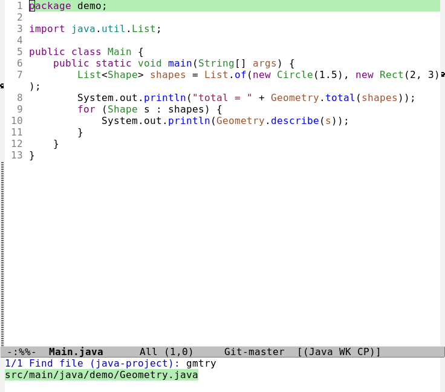
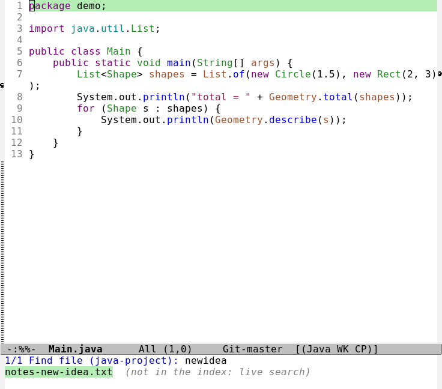
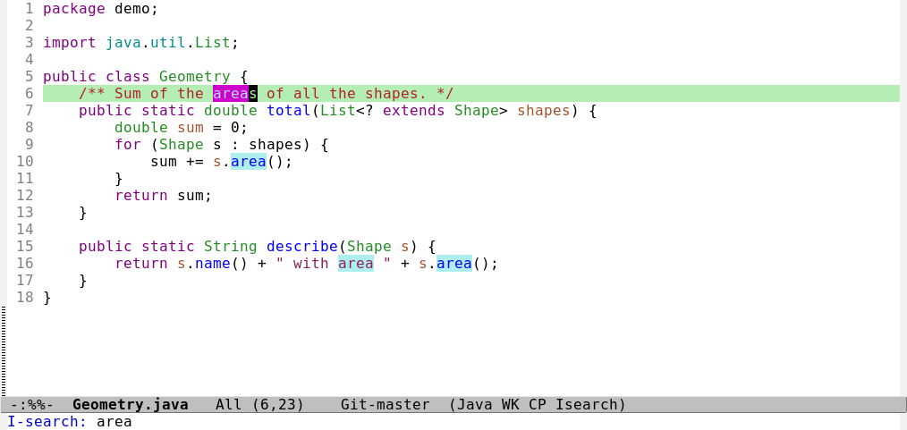
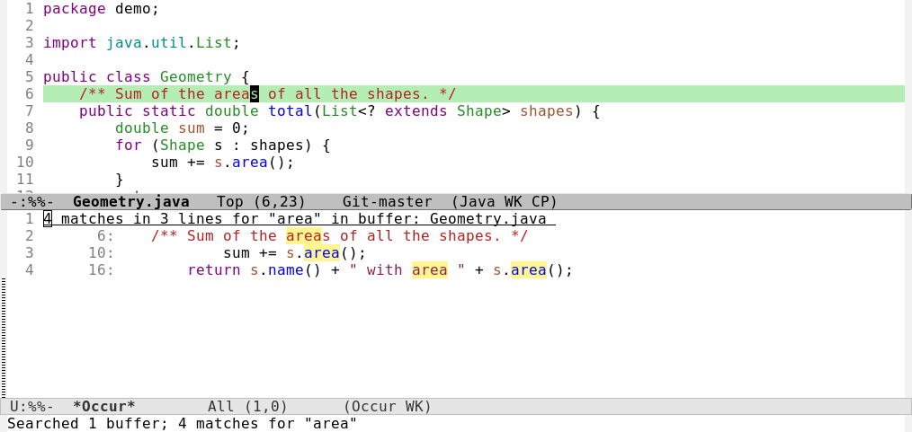
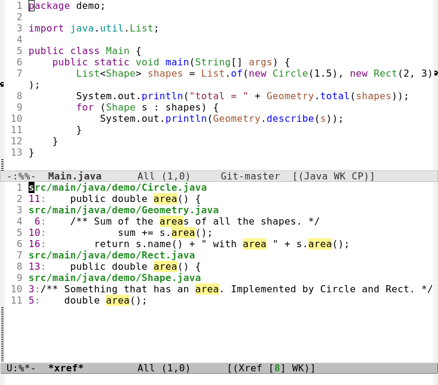
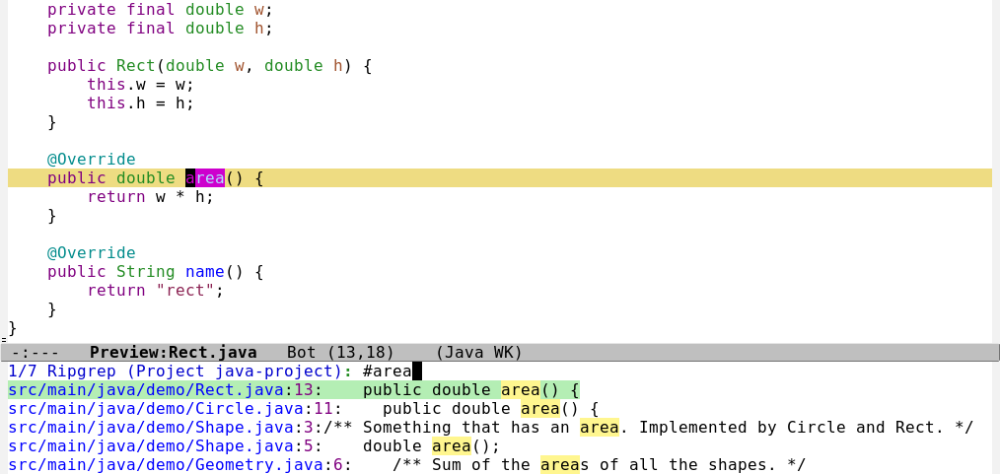
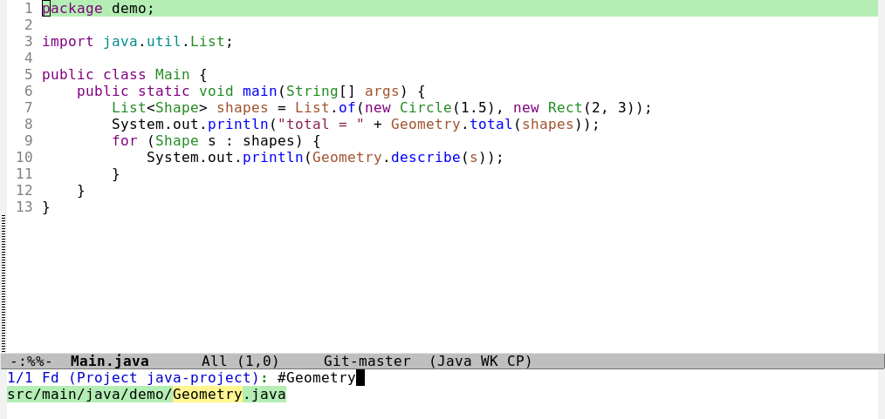

# Finding anything: files, text, code and help

Everything about searching in this Emacs, in one place: finding a file, finding text in a file, in a project or on
the whole disk, finding a definition or a use of a symbol, and finding help. Start with the table in section 1;
the rest explains each row.

> **What is verified.** Every key in the tables below is checked against this build by `tests/ert/keybindings.el`
> (it reads this file). The behaviors are ones I ran here, with the numbers measured; the screenshots are real
> windows. Where something is untested (mostly on Windows) it says so.

## 1. What do I do to...?

| I want to... | Do this | Section |
|---|---|---|
| Open a file by typing a few letters of its name (project or whole disk) | `C-c f f` / `C-c f g` | [2](#2-find-a-file) |
| Open one of the last files, folders or projects I used | `C-c h`, then a number or `RET` | [2](#2-find-a-file) |
| See the project as a tree | `C-c t` ([TREEMACS.md](TREEMACS.md)) | [2](#2-find-a-file) |
| Find text in **this file** | `C-s` | [3](#3-find-text-in-this-file) |
| List every line in this file that matches | `M-s o` | [3](#3-find-text-in-this-file) |
| Find text in **every file of the project** | `C-x p g` | [4](#4-find-text-in-many-files) |
| Find text in a folder that is not a project | `M-x rgrep` | [4](#4-find-text-in-many-files) |
| Replace text (this file, or the whole project) | `M-%`, `C-x p r` | [5](#5-search-and-replace) |
| Jump to where a method or class is defined | `M-.` | [6](#6-find-code-by-meaning) |
| See everything that uses it, or implements it | `M-?`, `M-x eglot-find-implementation` | [6](#6-find-code-by-meaning) |
| Find a method in this file, or a class anywhere by name | `M-g i`, `C-M-.` | [6](#6-find-code-by-meaning) |
| Find an Emacs command, key or setting | `C-h a`, `C-h k`, `C-h w`, `M-x` | [7](#7-find-help-and-commands) |
| Find an open buffer | `C-x b`, `C-x C-b` | [2](#2-find-a-file) |

## 2. Find a file

### The fast finder: `C-c f f` and `C-c f g`

Type a few letters of the file name. It shows the best matches at once and opens the one you pick with `RET`.

*Five letters, `gmtry`, find `Geometry.java` (it is not even a substring). The finder is described fully in
[NAVIGATING-CODE.md](NAVIGATING-CODE.md#the-instant-finder-c-c-f-f-and-c-c-f-g).*

<!-- keymap: global -->
| Key | Command | What it does |
|---|---|---|
| `C-c f f` | `my/ff-find-file` | find a file in this project; outside a project, anywhere on the disk |
| `C-c f g` | `my/ff-find-file-global` | find a file anywhere on the disk |
| `C-c f r` | `my/ff-reindex` | rebuild the whole-disk index now |

How it matches, so you know what to type:

| You type | It finds |
|---|---|
| `geometry` | files with that in the name, best first |
| `gmtry` | files whose name has those letters **in that order** (`Geometry.java`) |
| `demo shp` | files whose path matches **both** words (`demo/Shape.java`) |
| `notes.txt` | the exact name first, then longer paths |
| `GEOMETRY.JAVA` | case does not matter |
| `a.b` | a dot or bracket is just a letter here, not a pattern |

Two more things worth knowing:

- **A file that is new or in a folder the index skips is still found**, after a moment, by a live search. The list
  then says `(not in the index: live search)`.

  

- **The whole-disk index** is a plain list of file names, built in the background after Emacs has been idle for 90
  seconds and again when it is over 6 hours old. It leaves out `.git`, `node_modules`, caches and system
  folders (on Linux `/proc /sys /dev /run /mnt /tmp /snap`; on Windows `Windows`, `Program Files`, `ProgramData`
  and a few noisy `AppData` folders). The live search still looks in them. `M-x my/ff-status` shows how old
  the index is.

Measured: whole-disk index of 337,696 files built in about 1.2 s (Linux), queries 14 to 147 ms; a project 5 to
10 ms; the live search about 0.85 s. On Windows, a drive of 859,000 files indexed in 1.6 s with queries of 67 to
495 ms.

### The other ways to open a file

<!-- keymap: global -->
| Key | Command | Use it when |
|---|---|---|
| `C-c h` | `my/start` | you want one of your last 5 files, folders or projects ([START-SCREEN.md](START-SCREEN.md)) |
| `C-c t` | `my/treemacs` | you want to see the project as a tree ([TREEMACS.md](TREEMACS.md)) |
| `C-x p f` | `project-find-file` | you want Emacs's own project file list (the finder is faster and fuzzier) |
| `C-x p F` | `project-or-external-find-file` | you also want files from outside the project |
| `C-x p d` | `project-find-dir` | you want to browse one of the project's folders |
| `C-x p p` | `project-switch-project` | you want to jump to another project you used |
| `C-x C-f` | `find-file` | you know the path (it completes as you type) |
| `C-c r` | `recentf-open` | it is a file you opened before, anywhere (the last 25, searchable by typing) |
| `C-x d` | `dired` | you want to browse a folder and act on files |
| `C-x C-j` | `dired-jump` | you want Dired on the folder of the file you are in |
| `C-x b` | `switch-to-buffer` | it is already open |
| `C-x C-b` | `ibuffer` | you want the list of everything open (`/ n` filters by name) |
| `C-x p b` | `project-switch-to-buffer` | it is open and in this project |
| `C-x r m` | `bookmark-set` | mark this place so you can come back to it by name |
| `C-x r b` | `bookmark-jump` | jump to a bookmark |
| `C-x r l` | `bookmark-bmenu-list` | list your bookmarks |

Also, without a key:

| Run | What it does |
|---|---|
| `M-x find-name-dired` | files whose **name** matches a pattern (`*.java`), in a folder tree, as a Dired listing |
| `M-x find-grep-dired` | files under a folder that **contain** a pattern, as a Dired listing |
| `M-x find-dired` | the same with a full `find` command line |
| `M-x find-file-at-point` (`ffap`) | open the file name under the cursor |

`M-x locate` (the system file database) is in Emacs but the `locate` program is **not installed** on this Linux
machine, so it does nothing here; the finder above replaces it.

In Dired, `RET` opens a file, `^` goes up, `g` refreshes and `j` jumps to a file by name in that folder (the
first letters complete). More in [KEYBOARD.md](KEYBOARD.md).

## 3. Find text in this file

### Incremental search: `C-s`

Press `C-s`, then type. Emacs jumps to the first match **as you type** and highlights all of them. `C-s` again goes
to the next match, `C-r` to the previous, `RET` stops there, and `C-g` cancels and returns to where you started.

*`C-s area`: the match under the cursor is bright, the others are highlighted, and the search text is in the
echo area.*

<!-- keymap: global -->
| Key | Command | What it does |
|---|---|---|
| `C-s` | `isearch-forward` | search forward |
| `C-r` | `isearch-backward` | search backward |
| `C-M-s` | `isearch-forward-regexp` | search forward for a **regular expression** ([section 8](#8-regular-expressions-in-brief)) |
| `C-M-r` | `isearch-backward-regexp` | the same, backward |
| `M-s .` | `isearch-forward-symbol-at-point` | search for the whole word under the cursor |
| `M-s _` | `isearch-forward-symbol` | search for a whole symbol (so `area` does not match `areas`) |
| `M-s w` | `isearch-forward-word` | search for whole words |
| `M-s h r` | `highlight-regexp` | permanently highlight a pattern in this buffer |

While a search is running:

<!-- keymap: isearch-mode-map -->
| Key | Command | What it does |
|---|---|---|
| `C-s` | `isearch-repeat-forward` | next match |
| `C-r` | `isearch-repeat-backward` | previous match |
| `C-w` | `isearch-yank-word-or-char` | add the word at the cursor to the search text |
| `C-M-w` | `isearch-yank-symbol-or-char` | add the symbol at the cursor |
| `C-y` | `isearch-yank-kill` | paste what you last copied into the search |
| `M-s C-e` | `isearch-yank-line` | add the rest of the line |
| `M-e` | `isearch-edit-string` | edit the search text with the normal editing keys |
| `M-p` | `isearch-ring-retreat` | previous search you made |
| `M-n` | `isearch-ring-advance` | next one |
| `M-s c` | `isearch-toggle-case-fold` | turn case sensitivity on or off |
| `M-s r` | `isearch-toggle-regexp` | turn regexp mode on or off |
| `M-s w` | `isearch-toggle-word` | words only on or off |
| `M-s _` | `isearch-toggle-symbol` | whole symbols on or off |
| `M-s SPC` | `isearch-toggle-lax-whitespace` | let a space match any run of spaces |
| `M-s o` | `isearch-occur` | list every match in its own buffer (next section) |
| `M-%` | `isearch-query-replace` | replace this text ([section 5](#5-search-and-replace)) |
| `RET` | `isearch-exit` | stop, leaving the cursor on the match |
| `C-g` | `isearch-abort` | cancel and go back to where you started |

**Case.** An all-lowercase search ignores case (`area` finds `Area`); as soon as you type a capital it becomes
case-sensitive (`Area` finds only `Area`). `M-s c` overrides it.

### List every matching line: `M-s o`

`M-s o` (`occur`) asks for a pattern and shows **every matching line** of this file in a list below, with line
numbers. The same list opens from inside a search with `M-s o`.

*`4 matches in 3 lines for "area"`: click a line or press `RET` to go to it.*

<!-- keymap: global -->
| Key | Command | What it does |
|---|---|---|
| `M-s o` | `occur` | list the lines of this buffer that match a pattern |

<!-- keymap: occur-mode-map -->
| Key | Command | What it does |
|---|---|---|
| `RET` | `occur-mode-goto-occurrence` | go to that line |
| `o` | `occur-mode-goto-occurrence-other-window` | go to it in the other window, keeping the list |
| `C-o` | `occur-mode-display-occurrence` | show it in the other window without moving |
| `n` | `next-error-no-select` | next match, showing it |
| `p` | `previous-error-no-select` | previous match |
| `M-n` | `occur-next` | next line of the list |
| `M-p` | `occur-prev` | previous line of the list |
| `e` | `occur-edit-mode` | edit the matching lines **in the list** (they change in the file); `C-c C-c` finishes |
<!-- keymap: global -->

**To close the list:** `q` does nothing here (Occur has no quit key bound). Put the cursor in that
window and press `C-x 0` (`delete-window`); it closes just that window, leaving Treemacs, other
windows and the buffer itself untouched.

Other line-oriented commands, by name: `M-x how-many` (count the matches after the cursor), `M-x keep-lines` and
`M-x flush-lines` (keep or delete the lines that match, from the cursor on or in the region; they change the
text, so unlock the file first), `M-x multi-occur-in-matching-buffers` (search several open files).

## 4. Find text in many files

### The whole project: `C-x p g`

<!-- keymap: global -->
| Key | Command | What it does |
|---|---|---|
| `C-x p g` | `project-find-regexp` | search every file of the project for a pattern and list the matches |
| `C-x p r` | `project-query-replace-regexp` | search and replace across the project |

It asks for a pattern, searches every project file, and shows the matching lines grouped by file.

*`C-x p g` for `area`: each file is a heading, each match a line with its number.*

How it works here:

- It uses **ripgrep** (`rg`) when it is installed, which is 4 to 10 times faster than `grep` (measured: 56 to 63 ms
  against 226 to 670 ms over the 5,629 files of the Emacs source, with identical matches). Without ripgrep it falls back
  to `grep`. On Windows, ripgrep is in the bundle.
- It searches the files the project lists: every tracked file and new files git has not seen, **not** the ones
  `.gitignore` excludes (so `build/` and `*.class` do not clutter the results).
- You type an **Emacs regular expression** (`\|` for "or", `\(...\)` for groups); Emacs converts it for ripgrep.
  Tested: alternation, groups, character classes and repeat counts. Keep to the basics of [section 8](#8-regular-expressions-in-brief)
  and avoid Emacs-only escapes such as `\_<`, which may not carry over.
- **Case:** like `C-s`, an all-lowercase pattern ignores case and a capital makes it case-sensitive. Measured on
  the demo project: `circle` finds 5 matches (`Circle` and `circle`), `Circle` finds 4, `CIRCLE` finds 0.

The results list is the same one used for references and implementations (section 6):

<!-- keymap: xref--xref-buffer-mode-map -->
| Key | Command | What it does |
|---|---|---|
| `RET` | `xref-goto-xref` | open that match |
| `TAB` | `xref-quit-and-goto-xref` | open that match and close the list |
| `n` | `xref-next-line` | next match |
| `p` | `xref-prev-line` | previous match |
| `C-o` | `xref-show-location-at-point` | show it in the other window, keeping the list |
| `r` | `xref-query-replace-in-results` | replace across every match in the list |
<!-- keymap: global -->

**To close the list:** `q` does nothing here either. `TAB` closes it **and** jumps to the match under
the cursor in one step; to close it without going anywhere, put the cursor in that window and press
`C-x 0`.

With the mouse: a left click on a result opens it, a middle click shows it and keeps the list.

`M-x project-search` is a variant that stops at the first match; press `M-x fileloop-continue` for the next.

### A folder that is not a project, or old-style grep

| Run | What it does |
|---|---|
| `M-x rgrep` | search a folder tree for a pattern, in files matching a name pattern (uses `grep`, slower than the above) |
| `M-x lgrep` | the same for one folder, not its subfolders |
| `M-x grep` | run any `grep` command line and get a clickable list |
| `M-x vc-git-grep` | search the files git tracks |
| `M-x find-grep-dired` | files that contain a pattern, as a Dired listing you can then act on |

The results open in a `*grep*` buffer:

<!-- keymap: grep-mode-map -->
| Key | Command | What it does |
|---|---|---|
| `RET` | `compile-goto-error` | go to that match |
| `n` | `next-error-no-select` | next match, showing it |
| `p` | `previous-error-no-select` | previous match |
| `C-o` | `compilation-display-error` | show it in the other window |
| `g` | `recompile` | run the search again |
| `q` | `quit-window` | close the list |
<!-- keymap: global -->

And in any of these lists, `M-g n` (`next-error`) and `M-g p` (`previous-error`) move through the matches from
your code window without going to the list.

### Search files from Dired

Mark files in Dired (`m`), or work on all of them, then:

<!-- keymap: dired-mode-map -->
| Key | Command | What it does |
|---|---|---|
| `A` | `dired-do-find-regexp` | search the marked files for a pattern and list the matches |
| `Q` | `dired-do-find-regexp-and-replace` | search and replace in the marked files |
| `% g` | `dired-mark-files-containing-regexp` | **mark** the files that contain a pattern |
| `% m` | `dired-mark-files-regexp` | mark files whose **name** matches a pattern |
| `M-s a C-s` | `dired-do-isearch` | incremental search through the marked files |
| `M-s f C-s` | `dired-isearch-filenames` | incremental search in the file **names** |
<!-- keymap: global -->

## 5. Search and replace

<!-- keymap: global -->
| Key | Command | What it does |
|---|---|---|
| `M-%` | `query-replace` | replace, asking about each match |
| `C-M-%` | `query-replace-regexp` | the same with a regular expression |
| `C-x p r` | `project-query-replace-regexp` | replace across the whole project |

At each match Emacs asks: `y` replace this one, `n` skip it, `!` replace all the rest, `q` stop. Every file
opens read-only in this config, so **unlock a file first** (`C-c e e`) before replacing in it; a replace
across a project is refused on locked files rather than changing them silently.

## 6. Find code by meaning

Text search finds a *word*. To find where a method is **defined**, or every place that **uses** it, ask
the language server (Eglot), which understands the code. It needs `M-x eglot` once per session; full guide in
[EGLOT.md](EGLOT.md).

<!-- keymap: global -->
| Key | Command | What it does |
|---|---|---|
| `M-.` | `xref-find-definitions` | jump to the definition of the symbol under the cursor |
| `M-,` | `xref-go-back` | go back to where you were |
| `C-M-,` | `xref-go-forward` | go forward again |
| `M-?` | `xref-find-references` | list every place that uses it |
| `C-M-.` | `xref-find-apropos` | find symbols anywhere in the project by (part of) a name |
| `C-x 4 .` | `xref-find-definitions-other-window` | jump to the definition in another window |
| `M-g i` | `imenu` | list the classes and methods **in this file** and jump to one |

`M-x eglot-find-implementation` lists the implementations of an interface or method.

**Without a language server running, these keys do not search at all.** They report an error
(*"No Xref backend. Try M-x eglot, M-x visit-tags-table, or M-x etags-regen-mode"*), measured here in a Java file. Start the
server with `M-x eglot` and they work. Use `C-x p g` (section 4) for a plain text search of the word: that is the
difference between the two kinds of search. **Text search is complete but noisy** (it finds every occurrence
of the word, including ones that are not the same symbol); **Eglot is exact** but needs the server running.

## 7. Find help and commands

<!-- keymap: global -->
| Key | Command | What it does |
|---|---|---|
| `M-x` | `execute-extended-command` | run any command by name; the list narrows as you type |
| `C-h a` | `apropos-command` | find **commands** whose name contains a word |
| `C-h d` | `apropos-documentation` | find commands and variables whose **documentation** mentions a word |
| `C-h o` | `helpful-symbol` | show everything about a function, variable or face (this config's richer `helpful` page) |
| `C-h f` | `helpful-callable` | show a function's documentation (this config's richer `helpful` page) |
| `C-h v` | `helpful-variable` | show a variable's documentation and value (this config's richer `helpful` page) |
| `C-h k` | `helpful-key` | press a key to see what it runs (this config's richer `helpful` page) |
| `C-h w` | `where-is` | type a command name to see which key runs it |
| `C-h b` | `describe-bindings` | list every key active in this buffer |
| `C-h m` | `describe-mode` | describe the current mode and its keys |
| `C-h i` | `info` | open the manuals (in a manual: `s` searches the text, `i` looks in the index) |
| `C-h r` | `info-emacs-manual` | open the Emacs manual |
| `C-h .` | `display-local-help` | show documentation for the symbol at the cursor |
| `C-M-i` | `complete-symbol` | complete the word you are typing (from the language server when Eglot is running) |
| `M-/` | `dabbrev-expand` | complete it from words already in your open files |

In the `M-x` list, the vertical list of candidates narrows as you type and matches letters loosely
(`fndfl` finds `find-file`). `TAB` completes; `RET` runs it.

## 8. Regular expressions in brief

A regular expression is a pattern. Emacs's syntax has one habit that surprises people from other tools:
**grouping and alternation need a backslash**.

| To match | Write | Example |
|---|---|---|
| any one character | `.` | `a.c` matches `abc` |
| a literal dot | `\.` | `s\.area` |
| zero or more, one or more, optional | `*`  `+`  `?` | `ab*`, `ab+`, `colou?r` |
| this **or** that | `\|` | `area\|name` |
| a group | `\(` ... `\)` | `\(ab\)+` |
| exactly N, or N to M | `\{N\}`  `\{N,M\}` | `a\{2\}` |
| one of a set, or a range | `[abc]`  `[a-z]` | `[A-Z][a-z]+` |
| start or end of a line | `^`  `$` | `^import` |
| a word boundary | `\b` | `\barea\b` |
| any letter/digit character | `\w` | `\w+` |
| any whitespace | `\s-` | `foo\s-+bar` |

Tested against the real search (ripgrep) on the demo project: `area\|name` found 12 matches, `double area`
3, and `s\.area()` 2, each in the files expected.

To try a pattern and watch it match as you type, use `M-x re-builder`.

Where the syntax differs: the **fast finder** (section 2) takes plain letters, not patterns; `C-x p g` takes
Emacs syntax; `rgrep`, `lgrep` and `grep` take **grep's** syntax (where `|` and `()` need no backslash in `grep -E`).

## 9. Speed, and what makes a search slow

| Search | Typical time (measured here) |
|---|---|
| Finder, project | 5 to 10 ms per keystroke |
| Finder, whole disk (337,696 files) | 14 to 147 ms |
| Finder, live fallback | about 0.85 s |
| `C-x p g` over 5,629 files, with ripgrep | 56 to 63 ms |
| The same with `grep` | 226 to 670 ms |
| `C-s` in a file | instant (it searches as you type) |

Slow searches are almost always one of: **searching a folder that is not a project** with `rgrep` (it searches
everything, including `node_modules` and `.git`); **very large files** (a few megabytes with `M-s o`); or
**files on the Windows drive from WSL** (`/mnt/c`), where each file access is slow (measured: 2,000 files took
17.9 s there against 0.08 s on the Linux disk). Work inside the Linux folders, or run the Windows bundle.

## 10. Consult: one search box for several of the above

`consult` is a small package installed alongside Evil, Magit and Treemacs. It gives four commands that share
one idea: a completion list (the same vertical list `M-x` uses) that updates **live** as you type, with the
match **previewed** in the real window before you commit to it.

<!-- keymap: global -->
| Key | Command | Searches | Engine |
|---|---|---|---|
| `C-c s l` | `consult-line` | lines of **this buffer**, with a live preview as you move through matches | built in |
| `C-c s g` | `consult-ripgrep` | text across the **project**, grouped by file | ripgrep |
| `C-c s f` | `consult-fd` | **file names** across the project | `fd` |
| `C-c s b` | `consult-buffer` | open buffers, recent files and bookmarks, in one list | built in |

*`C-c s g area`: the results list (bottom) shows every match, grouped by file, exactly like `C-x p g`; moving to a
line shows it at once in the window above, **before** you press `RET`.*

Press `RET` (or click) to stay on the current candidate; `C-g` returns you to exactly where you were, with
nothing changed. Every file these open is still **read-only**, like everywhere else in this config
(`C-c e e` to edit); the preview itself never modifies a buffer.

**How this compares to what you already have:**

| | Consult | What you had |
|---|---|---|
| Search this buffer | `C-c s l`, with a live preview per match | `C-s` (incremental search) |
| Search project text | `C-c s g`, ripgrep, same results shape as `C-x p g`, but previewed live | `C-x p g` (`project-find-regexp`) |
| Find a file by name | `C-c s f`, `fd`, a literal/regexp match on the name | `C-c f f` (the fast finder: fuzzy, letters need not be contiguous, works from an index) |
| Switch buffers | `C-c s b`, one list with buffers, recent files and bookmarks together | `C-x b` / `C-x C-b` / `C-c r` (separate) |

None of these **replace** the originals; both keep working side by side. `consult-fd` is a plain name match, not
fuzzy like the fast finder (`gmtry` will not find `Geometry.java` through `C-c s f`, only through `C-c f f`); use
whichever suits the moment. `consult-ripgrep` and `project-find-regexp` use the same engine and the same smart-case
rule (an all-lowercase query ignores case; a query with a capital becomes case-sensitive), so their matches agree.

**Requires `rg` and `fd` on `PATH`.** `rg` was already installed on this machine; `fd` was not (Ubuntu ships it as
`fd-find`/`fdfind`, and installing that needs `sudo`, so it was instead downloaded as a checksummed release
binary into `~/.local/bin/fd`, the same way `jdtls` was — see [SEARCH-OPTIONS.md](SEARCH-OPTIONS.md#9-setting-up-rg-and-fd-again)
for the exact command). Without `fd`, `consult-fd` still runs (it falls back to `find`); without `rg`,
`consult-ripgrep` falls back to `grep`.

**Also on Windows.** The bundle carries `consult`, `rg` and `fd`, so all four keys work with nothing to
install; see [DISTRIBUTION.md](DISTRIBUTION.md) for the screenshot and the test results.

## 11. The minibuffer itself: vertico, orderless, marginalia, embark

Four small packages, installed alongside Evil/Magit/Treemacs/Consult, that change what *every* minibuffer
prompt looks like and how it matches --- not just Consult's own four commands, but `M-x`, `C-x C-f`, `C-x b`,
`C-x p f`, everything.

| Package | What it does |
|---|---|
| `vertico` | Shows candidates as a vertical list (replaces the built-in `fido-vertical-mode` this config used before) |
| `orderless` | Type the words of what you want in **any order** --- `to buf` and `buf to` both match `switch-to-buffer` |
| `marginalia` | Extra info next to each candidate: a command's own doc string in `M-x`, a file's size/permissions in `C-x C-f`, a buffer's major mode in `C-x b` |
| `embark` | `C-.` shows a menu of actions for whatever is at point, or the current minibuffer candidate --- open it, but also copy its name, delete it, run a shell command on it, without leaving where you are first. `C-;` runs the single most likely action directly; `C-h B` lists everything available right now |

<!-- keymap: global -->
| Key | Command | Does |
|---|---|---|
| `C-.` | `embark-act` | Menu of actions for the thing at point or the current candidate |
| `C-;` | `embark-dwim` | Run the default action directly, no menu |
| `C-h B` | `embark-bindings` | List every action available right now |

`embark-consult` (a separate, tiny companion package, also installed) needs no configuration at all: Embark
loads it automatically, on its own, the moment it notices Consult is also loaded --- this is what makes
`C-.` understand a `consult-ripgrep`/`consult-buffer` candidate specifically (act on one search match
without jumping to it first), not just treat it as a generic string.

**`orderless` is deliberately not used for file names.** Out-of-order matching is far more useful for
commands and buffer names than for paths, where it can match surprising things; file completion stays on
the plain `basic`/`partial-completion` styles instead --- plus `flex` (see below), kept everywhere.

**`flex` (built in, matches letters in order but not contiguously --- `gmtry` matches `Geometry.java`) is
kept alongside `orderless` everywhere, including files.** This is a real regression this project's own test
suite caught while adding the four packages above: the previous setup included `flex`, and `C-x p f`
(`project-find-file`) relies on exactly this kind of match; `orderless`'s own default matching (literal and
regexp only) does not reproduce it on its own. `C-c f f` (the fast finder) is unaffected either way --- it
always used its own, separate matching logic, not the global completion style.

**Falls back cleanly if not installed**, the same as every other package here: plain built-in
`fido-vertical-mode` instead, `embark`'s keys show "Embark is not installed" rather than failing.

## 12. Windows

Everything above works in the Windows bundle ([DISTRIBUTION.md](DISTRIBUTION.md)): the finder, `C-x p g`
(ripgrep is bundled), Dired, Occur and the help keys were tested there through the offline suite. Differences:

- The whole-disk index covers the drive of your home folder (normally `C:\`) and skips the Windows folders.
- `find-name-dired` and `find-grep-dired` use the `find` and `grep` that come with the bundled Git.
  `grep` from that package reads a backslash differently from Linux `grep`, so prefer `C-x p g` (ripgrep) for
  patterns with backslashes.
- Real-window checks on Windows covered the finder and Java navigation; `C-s`, `M-s o` and the Dired keys were
  exercised by tests, not by eye.

## 13. If a search finds nothing

| Symptom | Likely cause |
|---|---|
| `C-c f f` shows nothing | Fewer letters, or check the folder: outside a project it searches the whole-disk index (`M-x my/ff-status`) |
| A file is missing from `C-c f g` | It is in an excluded folder, or is new: wait for the "live search" line, or `C-c f r` |
| `C-x p g` misses a file | It is ignored by git, or hidden, or outside the project; use `M-x rgrep` on the folder |
| `C-x p g` finds nothing with a capital | A capital makes it case-sensitive. Use lowercase |
| A regexp finds nothing | You wrote `|` or `(` unescaped; in Emacs use `\|` and `\(` (section 8) |
| `M-.` or `M-?` says "No Xref backend" | No language server is running: `M-x eglot`, then try again |
| `M-.` finds nothing, or `M-?` misses a class | The server is still starting (Java: wait a few seconds), or the project layout is not recognised ([EGLOT.md](EGLOT.md#7-troubleshooting)) |
| `M-?` lists things that are not the symbol | You are using text search (`C-x p g`); use `M-?` with the server running for exact results |
| `C-s` does not find text you can see | Lax matching is off for spaces (`M-s SPC`), or the text has a different kind of space or accent |

## 14. Related guides

- [SEARCH-OPTIONS.md](SEARCH-OPTIONS.md): the inventory: every way to search that Emacs has, what we added, and what exists but is not installed.
- [NAVIGATING-CODE.md](NAVIGATING-CODE.md): the finder, in depth, and Java navigation with measured answers.
- [EGLOT.md](EGLOT.md): the language server client: definitions, references, implementations, diagnostics, rename.
- [TREEMACS.md](TREEMACS.md): the file tree.
- [START-SCREEN.md](START-SCREEN.md): the last 5 files, folders and projects.
- [KEYBOARD.md](KEYBOARD.md): every key, and [TYPING.md](TYPING.md) for pressing them fast.
