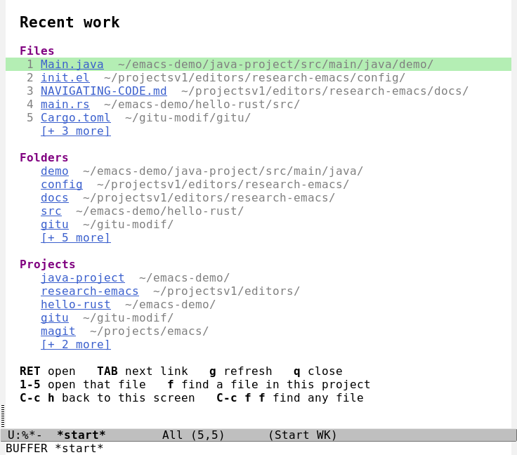
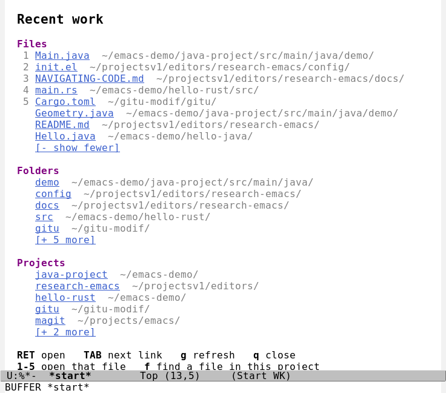

# The start screen

When you open Emacs without naming a file, it shows the last **5 files, 5 folders and 5
projects** you worked in. Each one is a link: press `RET` on it, or click it. A
**`[+ N more]`** link under each list expands it in place (up to 25). `C-c h` brings the
screen back from anywhere. Nothing to install: it is `config/startpage.el`.

Clicking `[+ 3 more]` under Files expands only that list, and the link turns into `[- show fewer]`:

> **What is verified.** 18 offline tests for the logic, a test inside a real window (`C-c h`),
> and three in a real terminal (the screen, expanding a list and opening a file, `C-c h`).
> The screenshots are real, but the entries in them are a seeded example history.

## Using it

<!-- keymap: global -->
| Key | Command | What it does |
|---|---|---|
| `C-c h` | `my/start` | show the start screen, from anywhere |
| `C-c r` | `recentf-open` | the older full list of recent files, searchable by typing |

Inside the start screen:

<!-- keymap: my/start-mode-map -->
| Key | Command | What it does |
|---|---|---|
| `RET` | `push-button` | open the file, or the folder or project in Dired, or expand/collapse the list |
| `TAB` | `forward-button` | move to the next link |
| `n` | `forward-button` | next link |
| `p` | `backward-button` | previous link |
| `g` | `my/start-refresh` | redraw (to pick up something you just opened) |
| `f` | `my/start-find-in-project` | with the cursor on a folder or project line, find a file in it by a few letters ([NAVIGATING-CODE.md](NAVIGATING-CODE.md)) |
| `1` | `my/start-open-nth-file` | open recent file number 1. `2` to `5` open files 2 to 5 |
| `q` | `quit-window` | close the screen |
<!-- keymap: global -->

With the mouse: click any link.

Files opened from here are read-only like every file in this config; `C-c e e` makes one editable
([KEYBOARD.md](KEYBOARD.md)).

## Where the lists come from

| List | Source |
|---|---|
| **Files** | Emacs's own recent-files list (`recentf`), newest first |
| **Folders** | The folder of every file you open, and every folder you open in Dired |
| **Projects** | The nearest parent folder holding `.git`, `.hg`, `pom.xml`, `build.gradle`, `Cargo.toml` or `package.json`. Your home folder is never a project |

Folders and projects are remembered in `config/recents.eld` (gitignored, so each computer has its
own). It is saved when Emacs exits and every 30 seconds of idle time after a change. If the file is
missing or damaged Emacs starts normally and rebuilds the lists from your recent files. Entries whose
file or folder no longer exists are skipped, so the list never shows something that cannot open.
Remote (TRAMP) paths are not remembered: checking them would try to connect at startup.

## Options

Set in `init.el` (they are plain variables):

| Variable | Default | Meaning |
|---|---|---|
| `my/start-count` | 5 | entries shown per list |
| `my/start-expanded-count` | 25 | entries shown after expanding |
| `my/start-keep` | 60 | folders and projects remembered |
| `my/start-ignore` | `/tmp/`, `.git/`, `elpa/`, backups... | regexps of paths never remembered |
| `my/start-project-markers` | `.git`, `pom.xml`, ... | what makes a folder a project |

To not open the start screen at startup, delete the line `(setq initial-buffer-choice ...)` from
`init.el`. `C-c h` keeps working.

## Behavior worth knowing

- `emacs somefile` opens that file, **not** the start screen. It appears only when you give no file.
  (The first version showed both, split; the terminal tests caught it. See [TROUBLESHOOTING.md](TROUBLESHOOTING.md).)
- It is drawn without line numbers, and the cursor starts on the first link.
- **Startup cost:** the file is about 200 lines and loads with `init.el`. Startup stays under the
  0.5 s the tests require.

## Where the idea comes from

Your earlier project `gitmacs` (`~/projects/emacs/magit`) has the same idea for Git repositories:
a landing page of recent and most-visited repos. Nothing in that project changed after 9 September.
This screen keeps its approach (a remembered list in a data file, one line per entry, `RET` to
jump) and applies it to files, folders and projects. Gitmacs's "most visited" count is not included;
say so if you want a "most visited" list too.
