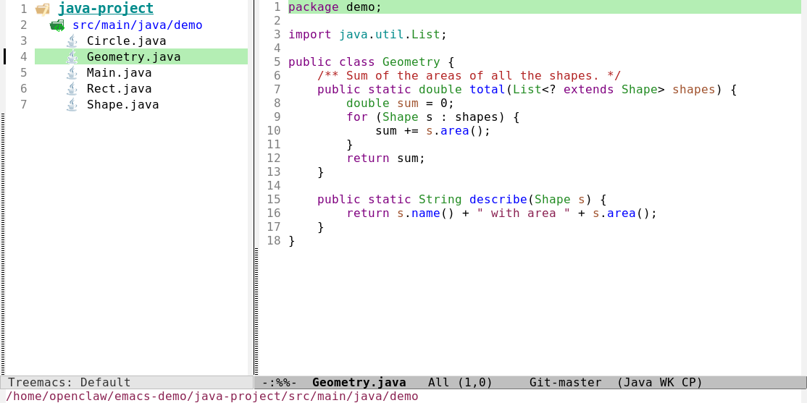

# Treemacs: a file tree in a sidebar

Treemacs shows your project's folders and files as a tree beside the code, like the explorer panel in VS Code.
`C-c t` shows it (and hides it again); `C-c T` moves into it, on the file you are editing. It is the third
package here besides Evil and Magit, installed by `./build.sh packages` into `config/elpa/` (gitignored).

*The demo project: the tree on the left, `Geometry.java` opened from it on the right (read-only, `%%` in the
mode line, as every file is here).*

> **What is verified.** 12 offline tests, one in a real window, and the keys in the table below are checked
> against this build (`keys/treemacs-keys-match-the-guide`). The screenshot is a real window. Treemacs was
> tried on Linux here only; it is in the Windows bundle but was not opened there.

## Using it

<!-- keymap: global -->
| Key | Command | What it does |
|---|---|---|
| `C-c t` | `my/treemacs` | show the tree of the project you are in; press it again to hide it. The first time it needs no prompt: it takes the project (or the folder) of the current file |
| `C-c T` | `my/treemacs-reveal` | show the tree and move into it, on the current file |

Two "follow" modes are switched on when Treemacs loads: the current file is kept highlighted in the tree, and
the tree switches to the project of the buffer you move to. So with one tree and a few projects you do not
manage the list yourself.

Inside the tree (`?` lists more; the popup is from Treemacs):

<!-- keymap: treemacs-mode-map -->
| Key | Command | What it does |
|---|---|---|
| `RET` | `treemacs-RET-action` | open the file, or expand or collapse the folder |
| `TAB` | `treemacs-TAB-action` | expand or collapse the folder |
| `n` | `treemacs-next-line` | next line |
| `p` | `treemacs-previous-line` | previous line |
| `u` | `treemacs-goto-parent-node` | go up to the parent folder |
| `H` | `treemacs-collapse-parent-node` | collapse the parent folder |
| `<backtab>` | `treemacs-collapse-all-projects` | collapse everything |
| `M-n` | `treemacs-next-neighbour` | next item at the same level |
| `M-p` | `treemacs-previous-neighbour` | previous item at the same level |
| `o v` | `treemacs-visit-node-vertical-split` | open the file in a new window to the side |
| `o h` | `treemacs-visit-node-horizontal-split` | open it in a new window below |
| `g` | `treemacs-refresh` | redraw after files changed outside |
| `t h` | `treemacs-toggle-show-dotfiles` | show or hide files starting with a dot |
| `w` | `treemacs-set-width` | set the tree's width |
| `>` | `treemacs-increase-width` | wider |
| `<` | `treemacs-decrease-width` | narrower |
| `y a` | `treemacs-copy-absolute-path-at-point` | copy the full path of this item |
| `y r` | `treemacs-copy-relative-path-at-point` | copy its path from the project root |
| `c f` | `treemacs-create-file` | **create** a file |
| `c d` | `treemacs-create-dir` | **create** a folder |
| `R` | `treemacs-rename-file` | **rename** it |
| `m` | `treemacs-move-file` | **move** it |
| `d` | `treemacs-delete-file` | **delete** it (asks first) |
| `C-c C-p a` | `treemacs-add-project-to-workspace` | add another project to the tree |
| `C-c C-p d` | `treemacs-remove-project-from-workspace` | remove a project from the tree |
| `q` | `treemacs-quit` | close the tree window |
| `Q` | `treemacs-kill-buffer` | close it and forget its state |
<!-- keymap: global -->

## Tree, finder, Dired or the start screen?

They answer different questions. None replaces the others.

| You want to... | Use |
|---|---|
| **See** what is in the project and its shape, and open files by looking | Treemacs, `C-c t` |
| Open a file whose name you remember, from anywhere | the finder, `C-c f f` ([SEARCHING.md](SEARCHING.md)) |
| Open something you were just working on | the start screen, `C-c h` |
| Do file operations on many files (copy, mark, rename by pattern) | Dired, `C-x d` |
| Look for text inside files | `C-x p g` ([SEARCHING.md](SEARCHING.md)) |

## Is Treemacs the best explorer?

It is the most complete tree sidebar I know of and the one most people use with Emacs. It knows about projects,
keeps the current file highlighted, has icons, and can hold several projects. But "best" depends on what you
want:

| | Treemacs | Dired (built in) |
|---|---|---|
| Looks like a sidebar tree | yes | no: a flat listing of one folder |
| Extra packages | 11 (Treemacs and 10 helpers, 12 MB in all) | none |
| Marking many files and doing something to all | limited | its strength |
| Keys to learn | many (table above) | many, but the same ones you use elsewhere in Emacs |

I have only tried Treemacs here, not the alternatives (`neotree`, `dired-sidebar`, `dirvish`, the built-in
`speedbar`). If you rarely look at the tree and mostly find files by name, the finder and Dired already cover
you; Treemacs earns its place when you want to see the layout of a project.

## What was set up

In `config/init.el`, section "Treemacs":

- `C-c t` and `C-c T`, defined by `my/treemacs` and `my/treemacs-reveal`. They exist because Treemacs's own
  `treemacs` command **asks for a folder** the first time and does not use Emacs's project detection to
  fill an empty tree; these do.
- Nothing loads until you press one of the keys: **startup is unchanged at 0.07 s** (measured), and loading
  Treemacs itself takes about 0.03 s.
- Its two follow modes, switched on when it loads.
- An exception to the read-only lock for its own bookkeeping file, `config/.cache/treemacs-persist` (the list of
  projects it remembers). The first version showed *"[Treemacs] Error (buffer-read-only treemacs-persist) when
  persisting workspace"* because the lock stopped Treemacs saving that list.

Git status colors in the tree are **not** turned on.

## The read-only lock and file operations

Opening a file from the tree opens it **read-only**, like everywhere else. But the tree's own commands `c f`,
`c d`, `R`, `m` and `d` create, rename, move and delete files directly, not through a buffer, so the read-only
lock does not stop them. They ask for the name or a confirmation first, and deleting asks "are you sure". If
you would rather they need a deliberate step like editing does, say so and I will remove those keys from the
tree.

## Not installed?

`C-c t` then says "Treemacs is not installed. Run ./build.sh packages", and nothing else breaks.

## If something is wrong

| Symptom | Cause and fix |
|---|---|
| The tree is empty or shows the wrong project | Press `C-c t` from a file inside the project. The tree follows the project of the current buffer; `C-c C-p a` adds another by hand |
| A `[Treemacs] Error ... buffer-read-only` message | The lock reached a file Treemacs writes. It is only meant to for `config/.cache/treemacs-persist`, which is exempt. Tell me the file name |
| Icons look plain | Treemacs draws its own small icons; in a terminal it falls back to text |
| A compile note about `hydra-ox.el` when installing | Harmless: that file extends Org, which this build has pruned. Nothing uses it |
